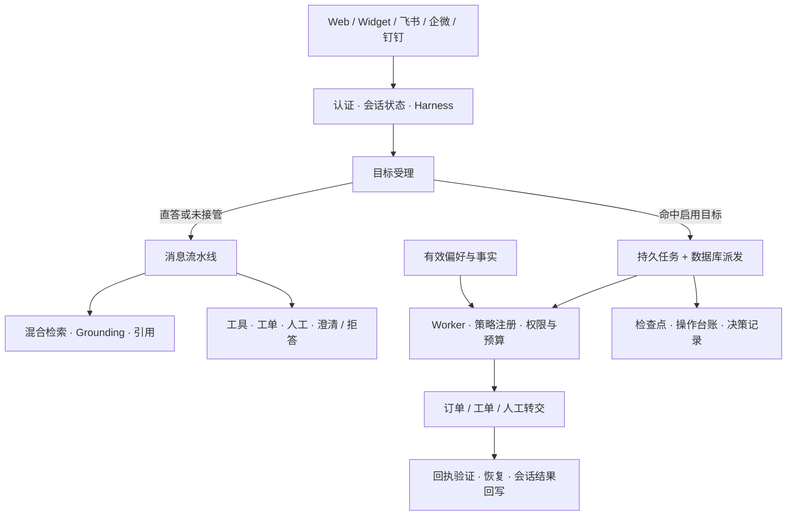

# AskFlow

**面向企业私有化部署的智能客服系统：有依据地回答，让服务任务可跟踪、可恢复。**

AskFlow 将 Honest RAG、受约束的 Agent、工单与人工协作放在同一客服平台中。支持单租户部署、多个消息渠道和按需启用的功能组合，无模型密钥也可运行本地抽取式问答。

[](https://github.com/RightCloudhub/AskFlow/actions/workflows/ci.yml)

[用户指南 / User guide](./docs/user-guide/README.md) · [快速开始](#快速开始) · [核心能力](#核心能力) · [架构](#架构) · [文档中心](./docs/README.md) · [项目状态](./docs/STATUS.md) · [反馈问题](https://github.com/RightCloudhub/AskFlow/issues)

## 目录

- [核心能力](#核心能力)
- [快速开始](#快速开始)
- [架构](#架构)
- [配置与功能组合](#配置与功能组合)
- [服务任务与客户记忆](#服务任务与客户记忆)
- [开发与测试](#开发与测试)
- [文档导航](#文档导航)
- [近期进展与路线图](#近期进展与路线图)
- [参与贡献](#参与贡献)

## 核心能力

| 能力 | 你可以做什么 |
|---|---|
| **Honest RAG** | 混合检索知识库，先检查证据再生成；弱证据拒答，答案带引用 |
| **持久服务任务** | 从聊天受理订单查询，保存检查点与操作台账，有限重试并在重启后继续处理 |
| **工单与人工协作** | 创建去重工单、暖转人工、认领接管、跟踪 SLA 与通知 |
| **客户记忆** | 明确确认偏好、按版本纠正和删除；任务运行时读取有效偏好与已验证事实 |
| **知识运营** | 上传与索引、知识缺口聚合、草稿审核、发布版本与回滚 |
| **多渠道接入** | Web、嵌入式 Widget、飞书、企业微信与钉钉共用客服处理能力 |
| **企业治理** | OIDC SSO、技能组、连接器、审计、用户导出/删除、质检与运营分析 |
| **模型与可观测** | 按 purpose 选模型与 fallback，记录 token/估计费用，提供运行回放与 Prometheus 指标 |
| **可插拔交付** | 使用 profile 与 feature 增量组合能力，在管理页查看插件依赖和加载状态 |

当前为 **`PILOT-READY + MULTI-CHANNEL`（代码层）**。完整客服 Agent 业务范围仍在分阶段接入；真实 IdP、业务连接器、负载及故障切换需在部署环境验收。能力证据与限制见 [STATUS](./docs/STATUS.md)。

## 快速开始

### 环境准备

- Python **3.11+**（CI 使用 3.12）
- Node.js **24** 与 npm（与 CI 一致）
- Git；Docker Compose 仅在需要 PostgreSQL / Redis / MinIO 时使用

```bash
git clone https://github.com/RightCloudhub/AskFlow.git
cd AskFlow
```

### 1. 启动 API

在仓库根目录运行：

```bash
cd apps/api
python3 -m venv .venv
source .venv/bin/activate
pip install -e ".[dev]"

export ASKFLOW_ENV=development
export SECRET_KEY=dev-secret-change-me
export DATABASE_URL=sqlite+aiosqlite:///./askflow.dev.db
export ASKFLOW_PROFILE=full

uvicorn app.main:app --reload --port 8000
```

开发启动会创建缺失的数据库表。SQLite、离线 embedding 与抽取式回答可用于本地开发；持久订单任务需要真实订单接口才能取得可验证结果。

### 2. 启动 Web

另开终端，在仓库根目录运行：

```bash
cd apps/web
npm ci
npm run dev
```

| 入口 | 地址 |
|---|---|
| 用户工作台 | http://localhost:5173 |
| API 文档 | http://localhost:8000/docs |
| 健康检查 | http://localhost:8000/health |
| 插件与能力 | http://localhost:5173/admin/plugins（agent/admin） |

前端通过 Vite 将 `/api`（含 WebSocket）代理到 API。新账号默认是普通用户，管理页需要相应角色。

### 3. 按需接入外部服务

```bash
# 在仓库根目录启动开发依赖
docker compose -f infra/compose/dev/docker-compose.yml up -d
```

切换数据库、配置订单接口或接入模型，见 [API 开发指南](./apps/api/README.md)。已有数据库升级请先读 [迁移说明](./apps/api/README.md#database-upgrades)：`create_all` 不会登记 Alembic 版本，不能直接在已存在的表上重复执行建表迁移。

## 架构



默认只有订单目标走持久任务路径；工单和人工转交可按目标白名单接管。退款与通知已有独立适配模块，尚未接入默认聊天/worker。消息流水线继续承担直接回答和未接管业务，详见 [运行时](./docs/architecture/customer-service-runtime.md) 与 [生命周期](./docs/architecture/customer-service-lifecycle.md)。

| 层次 | 技术 |
|---|---|
| API / 数据 | FastAPI · SQLAlchemy 2 async · Alembic · SQLite / PostgreSQL |
| 检索与生成 | BM25 + 内存余弦向量索引；可选 Chroma 与 OpenAI 兼容模型 |
| 调度与存储 | 服务任务使用数据库租约；索引队列可选 Redis；对象存储可用 MinIO / S3 |
| Web | React · TypeScript · Vite · Ant Design · TanStack Query · Zustand |
| 可观测 | Prometheus · Grafana · 运行记录与审计 |

```text
apps/
  api/                  # FastAPI、插件、服务任务、RAG 与后台 worker
  web/                  # 用户台、管理台与 Widget
packages/contracts/     # 行为契约与功能 manifest
evals/                  # golden、拒答语料与离线评测
docs/                   # 产品、架构、状态与工程规范
infra/                  # Compose、反代与监控配置
deploy/                 # 上线检查清单与 Runbook
scripts/ops/            # 代码指标检查
data/samples/           # 样例数据与改写词典
```

完整代码导航见 [目录结构](./docs/prd/STRUCTURE.md)。

## 配置与功能组合

环境变量在 API 启动前设置；配置来源见 `apps/api/app/core/config.py` 与 `services/agent/service/settings.py`。

| 配置 | 默认 / 用途 |
|---|---|
| `ASKFLOW_PROFILE` | `full`；也可选择 `enterprise`、`mvp`、`faq-only`、`core-only` |
| `ASKFLOW_FEATURES` | 可选插件增量，例如 `+sla,-mcp` |
| `SERVICE_TASKS_ENABLED` | `true`；启用目标受理与后台 worker（还需 Agent 插件） |
| `SERVICE_TASKS_GOALS` | `order_status`；可选增加 `ticket_resolution,human_handoff` |
| `SERVICE_TASK_POLL_SECONDS` | `5`；任务扫描间隔，最小 1 秒 |
| `ORDER_LOOKUP_URL` / `ORDER_LOOKUP_TOKEN` | 订单 HTTP 接口及可选 bearer token |
| `LLM_BASE_URL` / `LLM_API_KEY` | 可选 OpenAI 兼容生成与流式回答 |
| `EMBEDDING_*` / `CHROMA_HOST` / `CHROMA_PERSIST_DIR` | 可选外部 embedding 与 Chroma；Chroma 需安装 `.[vector]` |
| `INDEX_ASYNC` / `REDIS_URL` | 可选异步索引与 Redis 队列 |

`/admin/plugins` 只读展示 profile、依赖、启用/加载状态、路由与副作用。插件变更后需重启 API；页面没有在线安装或启停能力。配置清单以 [features.yaml](./packages/contracts/features.yaml) 为准，装配方式见 [插件架构](./docs/architecture/plugins.md)。

生产接入从 [试点检查清单](./deploy/checklists/pilot-integration.md) 开始；使用生产环境配置与独立密钥，完成真实依赖联调后再放量。

## 服务任务与客户记忆

订单消息带有效订单号时，系统先回复受理确认，再由 worker 查询与验证结果。订单接口需要返回匹配的 `customer_id`、`order_id` 和具体 `status`；缺少配置、mock 或归属不符时保留未解决状态。结果保存到聊天历史，当前没有后台结果的实时 WebSocket 推送。

| 接口（前缀 `/api/v1`） | 用途 |
|---|---|
| `GET /agent/tasks`、`GET /agent/tasks/{task_id}` | 查看本人任务和公开摘要 |
| `POST /agent/tasks/{task_id}/cancel` | 按版本取消目标，保留未决操作 |
| `POST /admin/service-tasks/{task_id}/accept-handoff` | 绑定当前人员已领取的转交并接管 |
| `GET /agent/preferences`、`PUT /agent/preferences` | 查看、确认和纠正客户偏好 |
| `DELETE /agent/preferences/{key}` | 按版本删除指定偏好 |

偏好支持 `language`、`response_detail`、`contact_channel`，要求明确同意，默认保留 30 天。事实、事件和经验已有内部存储模块；事实自动提取、经验自动学习和客户管理页面尚未接入。所有记忆只作为数据，不授予权限。

请求格式、版本冲突与保留规则见 [任务接口](./docs/architecture/customer-service-lifecycle.md)、[客户记忆](./docs/architecture/customer-preference-memory.md) 和 [API README](./apps/api/README.md)。

## 开发与测试

```bash
# API：在仓库根目录运行，先按快速开始安装开发依赖
cd apps/api
source .venv/bin/activate
python -m pytest -q
ruff check .
PYTHONPATH=. python ../../evals/runners/run_eval.py
```

```bash
# Web：在仓库根目录运行
cd apps/web
npm run build
```

```bash
# 代码硬指标：在仓库根目录运行
python3 scripts/ops/check_code_metrics.py
```

[CI](./.github/workflows/ci.yml) 执行 API pytest、离线 eval 与 Web build。服务任务测试显式调用 `run_once()`，测试环境不会自动启动后台循环。最新变更的专项复跑命令见 [API 验证](./apps/api/README.md#verification)，验证记录见 [STATUS](./docs/STATUS.md#4-验证记录)。

## 文档导航

| 你想了解 | 入口 |
|---|---|
| 项目全貌与知识总览 | [项目知识文档](./docs/KNOWLEDGE.md) |
| 从零开始使用：客户、客服与管理员 | [用户指南 / User guide](./docs/user-guide/README.md) |
| 从零开始配置：环境、功能、模型与外部连接 | [配置指南 / Configuration guide](./docs/configuration/README.md) |
| 当前完成情况与生产限制 | [项目状态](./docs/STATUS.md) |
| 产品需求与 Agent 目标 | [PRD v1.3](./docs/prd/PRD.md) · [客服 Agent 方案](./docs/prd/customer-service-agent.md) |
| 运行、恢复与任务控制 | [运行时](./docs/architecture/customer-service-runtime.md) · [生命周期](./docs/architecture/customer-service-lifecycle.md) |
| 架构与工程原则 | [架构索引](./docs/architecture/README.md) · [安全 / 性能 / 记忆三支柱](./docs/architecture/pillars.md) |
| 本地开发 | [API](./apps/api/README.md) · [Web](./apps/web/README.md) |
| 部署、监控与排障 | [试点接入](./deploy/checklists/pilot-integration.md) · [可观测索引](./docs/observability/README.md) · [Runbook](./deploy/runbooks/) |
| 全部文档 | [文档中心](./docs/README.md) |

## 近期进展与路线图

本轮文档对照最近五次提交（2026-10-03 至 2026-10-04）：

| 提交 | 变化 |
|---|---|
| [`2b38655`](https://github.com/RightCloudhub/AskFlow/commit/2b38655) | 持久客服任务、操作台账、故障恢复链与订单适配 |
| [`4527fbb`](https://github.com/RightCloudhub/AskFlow/commit/4527fbb) | 更新客服 Agent 方案的实施进展 |
| [`79dcdf4`](https://github.com/RightCloudhub/AskFlow/commit/79dcdf4) | 客户偏好、任务 API、聊天受理、后台派发与结果回写 |
| [`bd9828b`](https://github.com/RightCloudhub/AskFlow/commit/bd9828b) | 插件发现与只读管理页 |
| [`2bc7cd4`](https://github.com/RightCloudhub/AskFlow/commit/2bc7cd4) | 通用受理与业务域、事实/事件/经验存储、对象锁、预算和一致性测试 |

下一阶段重点：

- 自动续办与多目标依赖计划。
- 人工接单、外部事件唤醒和未知写入对账。
- 真实退款/通知连接器与完整业务验收。
- 记忆管理、经验消费与保留策略的完整接入。
- PostgreSQL 故障切换、多实例派发与部署环境验证。

阶段状态见 [Agent 差距清单](./docs/architecture/agent-conformance.md) 和 [重构计划](./docs/architecture/agent-refactoring-plan.md)。

## 参与贡献

1. 先阅读 [AGENTS.md](./AGENTS.md)、[行为契约](./docs/contracts/agent-behavior.md) 与相关模块文档。
2. 使用独立分支提交聚焦改动；同时更新受影响的文档和验证说明。
3. 新增操作应说明输入输出、权限、幂等、失败恢复与完成条件，并补充对应场景验证。
4. 提交前运行相关测试及代码指标检查；涉及前端时执行 Web build。

[代码硬指标](./docs/engineering/code-metrics.md) 适用于新增和改动代码：函数 ≤50 行、文件 ≤300 行、嵌套 ≤3 层、位置参数 ≤3、圈复杂度 ≤10，业务数字使用命名常量。修改超标文件时需同步拆分或收敛。

遇到问题请提交 [Issue](https://github.com/RightCloudhub/AskFlow/issues)，附上复现步骤、版本、运行 profile 和已脱敏的错误信息。助手工作指南还可参考 [CLAUDE.md](./CLAUDE.md)。
