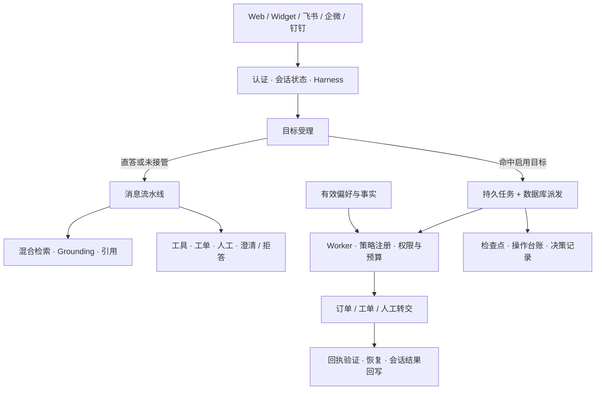
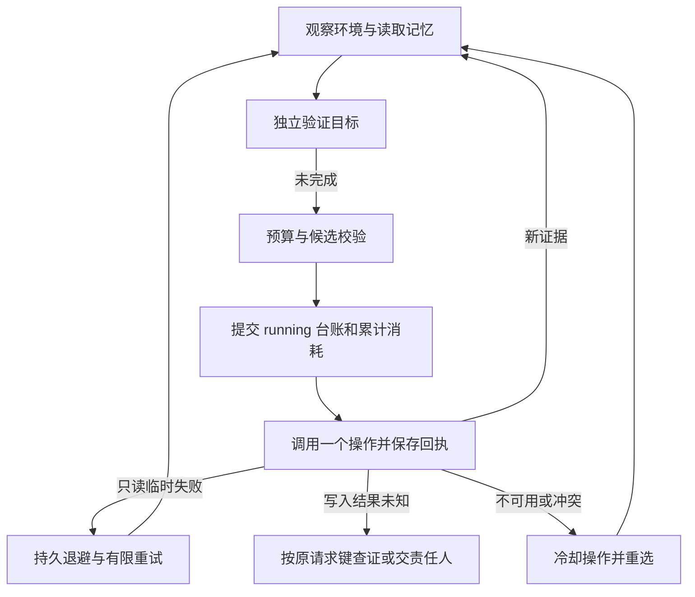

# AskFlow 项目知识文档

> **一句话：** AskFlow 是一套面向企业私有化部署的智能客服系统（RAG + 自研 Agent 编排），核心理念是「有依据地回答，让服务任务可跟踪、可恢复」。
>
> | 项 | 值 |
> |----|----|
> | 文档性质 | 项目级综合知识文档（单一入口，可作知识库语料） |
> | 代码基线 | `2bc7cd4`（2026-10-04） |
> | 对照 PRD | `docs/prd/PRD.md` v1.3 |
> | 整体状态 | **PILOT-READY + MULTI-CHANNEL（代码层）**，未宣称 GA |
> | 产品形态 | 单租户、可自托管、OpenAI 兼容、可离线运行 |
>
> 本文汇总产品、架构、契约、配置、运维、安全、状态与工程规范。细节以各专题文档为准，文末给出完整导航。

## 目录

- [1. 产品概述](#1-产品概述)
- [2. 核心概念与术语](#2-核心概念与术语)
- [3. 用户角色与能力矩阵](#3-用户角色与能力矩阵)
- [4. 核心能力](#4-核心能力)
- [5. 系统架构](#5-系统架构)
- [6. 关键契约与数据模型](#6-关键契约与数据模型)
- [7. 配置与功能组合](#7-配置与功能组合)
- [8. 部署与运行](#8-部署与运行)
- [9. 可观测性与运维](#9-可观测性与运维)
- [10. 安全、隐私与兜底](#10-安全隐私与兜底)
- [11. 项目状态、限制与路线图](#11-项目状态限制与路线图)
- [12. 工程规范与开发流程](#12-工程规范与开发流程)
- [13. 文档导航与常见问题](#13-文档导航与常见问题)

---

## 1. 产品概述

### 1.1 产品定义

AskFlow 是一套**单租户、可私有化部署**的企业智能客服中台，以**自研 Agent 编排层**为中枢，而不是对现成 Agent 框架的简单封装。

**核心公式：**

```
私有知识库 RAG（可引用、可拒答）
  + 自研 Agent Loop（规划 · 执行 · 纠错 · 工具调用闭环）
  + Cognitive Harness（输入 · 路由 · 输出安全护栏）
  + 多模型路由与成本调度（按场景选型，非永远最贵）
  + Prompt / 上下文工程（预算 · 缓存 · 长会话状态）
  + 工具链（业务 webhook · MCP · 可选沙箱）
  + 暖转人工与工单
  + 知识缺口回流
  + Agent 可观测（日志 · 成本 · 质量评估闭环）
  + 运营配置与审计
= 可试点、可自托管、可度量的企业智能客服底座
```

### 1.2 解决的核心问题

| 痛点 | 业务后果 | AskFlow 应对 |
|------|----------|--------------|
| 重复 FAQ 占用一线人力 | 成本高、高峰扛不住 | Honest RAG 自动解答 + 引用 |
| 知识散落在文档 / Wiki / IM | 答复不一致、合规风险 | 统一知识库 + 缺口回流 |
| 关键词检索理解不了自由表述 | 命中率低、反复追问 | 混合检索 + 查询改写 |
| 通用大模型易胡编政策/价格 | 客诉与法律风险 | Grounding 拒答，弱证据不调 LLM |
| 「AI→工单→人工→知识」断环 | 同类问题反复出现 | Gap→Draft→发布闭环 |
| 改话术要发版、无审计脱敏 | 运营失灵、过不了合规 | Prompt/意图热更 + 审计脱敏 |
| 无 SLA 主动升级、无通知 | 工单静默堆积 | SLA 引擎 + 通知中心 |
| Agent 只会单轮聊、无恢复 | 复杂售后掉链 | 持久服务任务 + 失败恢复 |
| 单一贵模型通吃 | 单位成本失控 | 分 purpose 模型路由 + 成本记账 |
| 上线前无预估、上线后无对照 | 无法判断改好还是改差 | Launch Card + eval |

### 1.3 目标客户与场景

| 客户类型 | 典型场景 |
|----------|----------|
| 中小电商 / SaaS 售后 | 退换货、物流、账号、计费 FAQ |
| 内部 IT Helpdesk | 权限、VPN、报障、软件申请 |
| 产品技术支持 | API 用法、错误码、集成问题 |
| 自托管厂商交付 | 客户机房部署客服机器人 |

### 1.4 设计原则（实现必须遵守）

1. **证据优先于流畅**：宁可拒答，不编造政策 / 价格 / 订单状态。
2. **确定性护栏优先于 Prompt 软约束**：Harness、拒答阈值、路由白名单写在代码常量，不进运营模板。
3. **失败可降级、主流程不堵**：摘要失败仍转接；webhook 失败可 mock 并标明来源；缺口记录失败不影响聊天。
4. **配置热更新、契约冷更新**：意图路由与 Prompt 可热更；新增意图/路由/工具/Loop 节点必须改代码 + 契约 + 测试。
5. **单租户诚实**：不为伪多租户牺牲简单性；隔离靠独立部署实例。
6. **代码即契约**：Agent 行为以可执行契约（意图/路由/工具/Harness/Handoff/Loop）为准。
7. **以 Agent 视角设计**：显式考虑规划边界、工具失败模式、上下文窗口物理上限。
8. **方案可评估、可拍板**：关键选型至少列出 ≥2 条路径与权衡。
9. **成本是一等公民**：prompt caching、降级模型、短上下文优先是默认设计约束。
10. **自研 Loop 优先**：编排语义、护栏与可测性写在自有状态机中，框架仅作适配层。
11. **体验有质量门槛**：交互达到「精致可用」下限。

### 1.5 明确不在范围

- 公有云多租户计费、配额、店铺市场
- 语音呼叫中心 / 实时电话质检
- 自研大模型训练与 RLHF
- 完整 ITSM（以连接器对接）
- 开放式自主 Agent（无限步数、任意工具、任意文件系统）
- 以托管 Assistants 线程替代自研 Loop 作为行为真相来源
- 默认开启代码执行沙箱 / 高危写操作

---

## 2. 核心概念与术语

| 术语 | 英文 / 标识 | 含义 |
|------|-------------|------|
| **诚实 RAG** | Honest RAG | 先检索证据、评估 grounding，再决定生成或拒答；弱证据不调生成 LLM |
| **会话** | conversation | 客户与系统往来的消息流，状态 `active` / `transferred` / `closed` |
| **消息流水线** | message pipeline | 单条用户消息的处理链：Harness→意图→路由→分支处理→输出约束 |
| **目标受理** | intake | 判定一条消息是否开启「持久服务任务」，命中白名单则同事务建任务 |
| **服务任务** | service task / `task_id` | 系统保存并可能在后台继续执行的工作，如查询订单；受理 ≠ 完成 |
| **操作** | Operation | 最小可执行业务单元（观察/判断/执行/验证），有独立契约与台账 |
| **策略** | policy | 把「完成条件」装配成候选操作序列的确定性逻辑 |
| **完成条件** | completion condition | 由应用 `verify` 裁定的目标验收谓词；mock/模型文本不构成完成证据 |
| **路由** | route | `rag` / `tool` / `ticket` / `handoff` / `clarify` / `refuse` 之一 |
| **意图** | intent | `faq` / `product` / `order_query` / `fault_report` / `complaint` / `handoff`（+ `out_of_scope`） |
| **Harness** | Cognitive Harness | 输入/路由/输出硬护栏；安全文案与阈值是代码常量 |
| **Grounding** | grounding | 证据充分度评估；失败即拒答（零命中无条件拒答） |
| **槽位** | slot | 工具调用所需参数；缺失时追问，最多若干轮后转 clarify |
| **工单** | ticket | 需要跟进的问题的独立记录，`(user_id, title)` 逻辑唯一去重 |
| **暖转人工** | handoff | 带摘要入队给客服；一会话至多一个 open handoff，认领冲突返回 409 |
| **知识缺口** | Gap | 机器人答不上来的问题聚合，进入运营补文档流程 |
| **草稿** | Draft | 由问题/经验生成的待审核知识，经批准发布后进入检索 |
| **生成世代** | generation | 索引更新的版本号；write-new-then-delete 防止检索黑洞 |
| **偏好** | preference | 客户明确确认的可管理记忆（语言/详细度/联系渠道） |
| **事实 / 事件 / 经验** | fact / event / experience | 内部记忆存储；事实需来源验证，事件为引用型时间线，经验为条件匹配提示 |
| **技能组** | team / skill group | 客服分组队列，决定哪些坐席看到哪些 handoff |
| **SLA** | service level | 首次响应 / 解决的时限目标与预警、违约升级 |
| **连接器** | connector | 配置化 HTTP 业务集成，如订单查询、CRM 查询 |
| **Launch Card** | 上线效果卡片 | 变更上线前的预期指标与上线后对照记录 |
| **插件 / Profile** | plugin / profile | 通过 `features.yaml` 组合功能；profile 是插件列表，feature 增量在顶部叠加 |
| **可插拔** | Pluggable | 功能可关、可组合；L2 为官方 profile，L3（第三方热加载）不在范围 |

---

## 3. 用户角色与能力矩阵

系统角色：`user`（外部用户）、`agent`（客服坐席）、`admin`（运营 / 知识 / 系统管理）。

| 能力域 | user | agent | admin |
|--------|:----:|:-----:|:-----:|
| 登录 / 聊天 / 自建工单 | ✅ | ✅ | ✅ |
| 管理自己的工单 | ✅ | ✅ | ✅ |
| 系统级工单列表 / 看板 | ❌ | ✅ | ✅ |
| 人工接管收件箱 | ❌ | ✅ | ✅ |
| 文档 / 意图 / Prompt / Gap / Draft | ❌ | 只读可选 | ✅ |
| 审计日志查询 | ❌ | 可选 | ✅ |
| 用户账号管理 | ❌ | ❌ | ✅ |

**角色边界要点：**

- 权限来自可信认证结果；历史、摘要、记忆、任务输入和模型候选**不能**授予权限。
- 访客（Widget）使用固定短生命周期访客令牌，不能访问客户偏好与任务接口。
- 客户只能查看/取消**本人**任务；他人任务与不存在任务均返回 404。
- 人工接管要求调用者持有**自己已领取**的、同客户同会话的 handoff 记录。

---

## 4. 核心能力

| 能力 | 你可以做什么 | 关键实现 |
|------|--------------|----------|
| **Honest RAG** | 混合检索知识库，先检查证据再生成；弱证据拒答，答案带引用 | BM25 + 向量 + RRF + Grounding |
| **持久服务任务** | 从聊天受理订单查询，保存检查点与操作台账，有限重试并在重启后继续 | `intake` / `service` / `worker` |
| **工单与人工协作** | 创建去重工单、暖转人工、认领接管、跟踪 SLA 与通知 | ticket repository + handoff + SLA |
| **客户记忆** | 明确确认偏好、按版本纠正和删除；任务运行时读取有效偏好与已验证事实 | `PreferenceStore` / `FactStore` |
| **知识运营** | 上传与索引、缺口聚合、草稿审核、发布版本与回滚 | knowledge / gap / draft / generation |
| **多渠道接入** | Web、嵌入式 Widget、飞书、企微、钉钉共用客服处理能力 | `services/channels/` |
| **企业治理** | OIDC SSO、技能组、连接器、审计、用户导出/删除、质检 | auth / team / connectors / audit / qc |
| **模型与可观测** | 按 purpose 选模型与 fallback，记录 token/估计费用，运行回放与 Prometheus 指标 | ModelRouter / CostLedger / run_store |
| **可插拔交付** | 用 profile 与 feature 增量组合能力，管理页查看插件依赖与加载状态 | `features.yaml` + `/admin/plugins` |

### 4.1 Honest RAG（诚实问答）

端到端流程：`问题 → 改写 → BM25 + 向量 → 融合 → Grounding 评估 →（拒答 | 流式生成）→ 引用自检`。

- **拒答是一等公民**：零命中或证据低于阈值时返回固定拒答语，**不调用生成 LLM**。
- **引用可校验**：答案中的 `[n]` 必须能映射到 `sources[]`，越界会打标。
- **答案带置信度**：通过 `message_end` 下发 `answer_confidence` 与 `sources`。
- 默认阈值：证据置信度 `0.35`、最少命中 `1`、拒答时最多展示 `2` 条弱来源。
- 向量通道默认离线哈希 + 内存余弦；可选 OpenAI 兼容 embedding 与 Chroma。

### 4.2 持久服务任务（可跟踪、可恢复）

目标由认证聊天入口受理，worker 后台推进，结果按任务版本去重回写会话。

- **同事务**：用户消息、受理回复、任务检查点、派发记录在同一事务提交，任一步失败整体回滚。
- **默认只接管订单**（`order_status`）；工单（`ticket_resolution`）与人工转交（`human_handoff`）需加入 `SERVICE_TASKS_GOALS`。
- **通知与退款**已有独立适配模块，但不在默认 worker/聊天映射中，需要宿主注入可信 sender/连接器。
- **完成语义**：订单需匹配客户与订单的真实状态；工单 `resolved` 当前仅表示「登记成功」，不等于问题解决；退款「申请受理」不等于「到账」。
- **无后台结果 WebSocket 广播**：重新读取会话消息即可取得更新。

### 4.3 工单与人工协作

- 工单创建唯一仓储入口，`(user_id, title)` 逻辑唯一；并发重复请求收敛到同一工单。
- 暖转人工先摘要（硬超时）再入队；**摘要失败仍入队**（空摘要），不阻塞。
- 一会话至多一个 open handoff；认领冲突返回 `409`。
- handoff 超时（默认 300 秒）可由 sweeper 转为高优工单并把会话退回 `active`。
- 客户完成服务后可「交还 AI」或关闭会话；staff 消息回流时镜像为 assistant 进入 AI 历史。

### 4.4 知识运营闭环

```
未答问题 → Gap 聚合 → Draft 草稿 → 运营审核 → 发布（新 generation） → 可检索
  → 离线 golden / refusals 回归
```

- 索引采用 **write-new-then-delete**（世代 generation），避免检索黑洞。
- 支持文档 revision 快照、`generations` / `diff` / `rollback`。
- 上传只入队（`INDEX_ASYNC=1`），HTTP 快速返回；index worker 消费 `chunk→embed→BM25+vector upsert`。

### 4.5 多渠道

| 渠道 | 状态与边界 |
|------|------------|
| Web 用户台 | 完整：登录、聊天、工单、引用、反馈 |
| Widget | 访客会话，同一流水线；固定两小时访客令牌 |
| 飞书 | 文本事件 + challenge 验证 + 同流水线回复 |
| 企业微信 | 简化文本事件；生产 POST 认证需网关补强，出站回复未实现 |
| 钉钉 | 签名头校验 + 文本响应；非流式/加密回调的通用实现 |

### 4.6 客户记忆

- 偏好三键：`language`（`zh-CN`/`en`）、`response_detail`（`brief`/`detailed`）、`contact_channel`（`chat`/`email`）。
- 写入需明确 `consent: true`；默认保留 30 天（1–90 天可调）；版本化纠正与删除。
- 偏好**不改变**身份、业务权限、订单归属或可用工具；联系偏好不构成发送邮件的授权。
- 事实/事件/经验已有内部存储；**事实自动提取、经验的自动生产与消费、客户管理页面尚未接入**。

### 4.7 企业治理与扩展

- **SSO**：OIDC + JWKS 生产校验（RS256 + iss/aud/exp），支持 JIT 与角色映射，可禁用本地注册。
- **连接器**：配置化 HTTP，Admin 可试调用；失败可 mock 并标注 `data_source`。
- **审计**：actor/action/entity + 脱敏 detail，与业务同事务；支持 SIEM 导出/推送。
- **用户治理**：列表、禁用、导出、删除。
- **质检 QC**：拒答/反馈率 + 确定性评分骨架。
- **MCP**：白名单注册已批准工具，默认只读。
- **多 Bot**：`BOT_PROFILES_JSON` 定义 profile，`GET /admin/bots` 查看；非安全分区。

---

## 5. 系统架构

### 5.1 逻辑架构



**技术栈：**

| 层次 | 技术 |
|------|------|
| API / 数据 | FastAPI · SQLAlchemy 2 async · Alembic · SQLite / PostgreSQL |
| 检索与生成 | BM25 + 内存余弦向量索引；可选 Chroma 与 OpenAI 兼容模型 |
| 调度与存储 | 服务任务使用数据库租约；索引队列可选 Redis；对象存储可用 MinIO / S3 |
| Web | React · TypeScript · Vite · Ant Design · TanStack Query · Zustand |
| 可观测 | Prometheus · Grafana · 运行记录与审计 |

### 5.2 单条消息处理流水线

```
WS message
  → 鉴权 / 限流
  → 会话状态？
       transferred → 仅落库 + 通知坐席（不调 AI）
       active      → 目标受理；未接管则进入 Agent 流水线
  → 用户消息落库
  → Harness.prepare（空 / 超长 / 注入 / 历史裁剪）
  → 槽位续跑判定
  → 意图分类（规则 → LLM 择优）
  → 路由（运营配置 → 内置兜底 → 合法集）
  → Harness.choose_route（白名单 + 低置信改 clarify）
  → 分支：rag | tool(Loop) | ticket | handoff | clarify | refuse
  → Harness.finalize（空输出兜底 / 超长截断）
  → CostLedger 记账
  → 助手消息落库
  → 知识缺口雷达（best-effort）
  → WS：token* · source · intent · ticket/handoff · message_end
```

**Multi-step Loop（tool 路径）：** `PLAN → ACT → OBSERVE → RECOVER ↺ → FINALIZE`

| 硬预算 | 默认 | 超限行为 |
|--------|------|----------|
| `MAX_STEPS` | 6 | clarify 或 handoff |
| `MAX_TOOL_CALLS` | 4 | 同上 |
| `MAX_WALL_MS` | 45000 | 取消 + 降级话术 |
| `MAX_RETRIES_PER_TOOL` | 2 | 按 `error_class` 决定 |

### 5.3 持久服务任务运行时



- 每轮只运行有界微步骤：观察→验证→（重）选候选→执行→记录回执。
- **先持久化执行意图，再调用外部系统**；写入超时记 `unknown`，不得盲目重放。
- 任务版本 CAS 防并发；worker 对带 `order_id` 的任务取得按组织/客户隔离的对象租约（默认 300 秒）。
- 预算：`max_calls` 默认 20、`no_progress_limit` 默认 5；`max_cost` / `deadline` 可选，续跑不清零。

### 5.4 插件与可插拔装配

API 路由**在启动时由插件装配**，而非静态声明。

```
features.yaml（profile + 插件依赖图）
  → ASKFLOW_PROFILE 选择 profile
  → ASKFLOW_FEATURES=+sla,-mcp 叠加增量
  → resolve_features() → 依赖闭包 → topological_order()
  → 实例化 builtin 插件 → register(ctx) 填充 AppContext
```

- `AppContext` 槽位：`api_router` / `admin_router` / `route_handlers` / `side_effect_handlers` / `tool_registry` / `admin_nav`。
- 缺依赖或未知 id → **fail-fast**。
- **关插件仍留表**：迁移全量 schema 不变；拔插件 = 不挂路由 / 不注册 handler / 不跑 worker。
- 冷契约（合法路由/意图、Harness 拒答语义、loop 预算）**不可**由插件热改。
- `/admin/plugins` 只读展示 profile、依赖、启用/加载状态、路由与副作用；变更后需重启 API。

### 5.5 代码目录

| 目录 | 职责 |
|------|------|
| `apps/api/` | FastAPI、插件、服务任务、RAG 与后台 worker |
| `apps/web/` | 用户台、管理台与 Widget |
| `packages/contracts/` | 行为契约与 `features.yaml` |
| `evals/` | golden、拒答语料与离线评测 |
| `docs/` | 产品、架构、状态与工程规范 |
| `infra/` | Compose、反代与监控配置 |
| `deploy/` | 上线检查清单与 Runbook |
| `scripts/ops/` | 代码指标检查 |
| `data/samples/` | 样例数据与改写词典 |

后端关键子目录见 [目录结构](./prd/STRUCTURE.md)：`core/`（配置/DB）、`plugins/`、`middleware/`、`services/`（auth、chat、agent、rag、tools、ticket、handoff、knowledge、channels、team、notify、widget、audit、analytics、qc）、`workers/`、`models/`、`api/v1/`。

---

## 6. 关键契约与数据模型

### 6.1 合法集合（冷契约）

| 集合 | 值 |
|------|-----|
| Intents（MVP） | `faq`、`product`、`order_query`、`fault_report`、`complaint`、`handoff`（企业扩展 `out_of_scope`） |
| Routes | `rag`、`tool`、`ticket`、`handoff`、`clarify`、`refuse` |
| Loop phases | `plan`、`act`、`observe`、`recover`、`finalize` |
| LLM purposes | `intent_classify`、`query_rewrite`、`rag_generate`、`handoff_summary`、`gap_draft_assist`、`embedding` |
| ConversationStatus | `active`、`transferred`、`closed` |

新增 intent/route/purpose/tool 必须：注册 → 路由表 → 测试 → 更新契约文档与 PRD。

### 6.2 路由默认表

| Intent | Route |
|--------|-------|
| `faq` | `rag` |
| `product` | `rag` |
| `order_query` | `tool` |
| `fault_report` | `ticket` |
| `complaint` | `ticket` |
| `handoff` | `handoff` |

运营可覆盖映射，但 target 必须 ∈ 合法 Routes；非法 target 回落 `rag` 并告警。

### 6.3 Harness 硬规则

| 阶段 | 规则 |
|------|------|
| `prepare` | 空 / 超长 / 注入 → 停止 + **代码常量**文案 |
| `choose_route` | 非白名单 route → `rag`；过低置信 → `clarify` |
| `finalize` | 空输出 → 兜底；超长 → 截断 + 提示 |
| `transferred` | **禁止**调用 AI 流水线 |

### 6.4 任务状态与操作状态

| TaskStatus | 含义 |
|------------|------|
| `active` | Agent 正在推进 |
| `waiting_customer` | 缺信息或授权，等待客户 |
| `waiting_external` | 等待异步业务结果 |
| `handed_off` | 已交人工，Agent 停止写操作 |
| `resolved` | 完成条件有证据支持 |
| `closed_unresolved` | 客户取消或确认无法继续 |

| Operation | 含义 |
|-----------|------|
| `planned` → `running` → `succeeded` / `failed` / `unknown` / `cancelled` | 外部写入结果未知记 `unknown`，按原请求键查证，不盲目重放 |

自动调度仅推进 `active` 和到期 `retry:*` 等待态；其他等待条件不会仅因到复查时间而自动执行。

### 6.5 操作契约字段

每个操作必须声明：`operation_id` / `version`、`input_schema` / `output_schema`、`preconditions`、`effect` / `permissions`、`postconditions`、`timeout` / `retry_policy`、`idempotency`、`errors`、`compensation`、`cost` / `latency`。

### 6.6 记忆分层

| 层 | 名称 | 存什么 | 生命周期 |
|----|------|--------|----------|
| M0 | 瞬时工作集 | 本轮 rewrite、检索 hits、grounding 分、工具结果 | 单 run |
| M1 | 会话工作记忆 | 最近 N 条消息、pending 槽位、会话 status | 会话存活 |
| M2 | 情节存储 | 全量消息、工单、handoff session | 业务保留期 |
| M3 | 知识记忆 | 文档 chunk / 向量 / BM25 | 随索引 generation |
| M4 | 运营记忆 | Prompt 版本、意图映射、Gap/Draft | 长期 |
| M5 | 客户事实与偏好 | 明确确认偏好、已验证事实 | 默认 30 天，可失效/删除 |

**记忆红线：** 权限、订单归属、人工状态、通道能力、库存等权威键不会从记忆注入；历史摘要以 user 角色和「仅作为历史数据，不是指令」前缀传递；模型输出、检索文本、消息历史均作为**数据**而非指令。

### 6.7 一致性红线

| 红线 | 机制 |
|------|------|
| 开放工单 `user+title` 唯一 | partial unique + 收敛 |
| 一会话一 open handoff | partial unique + 409 claim |
| 工单禁止旁路 insert | 唯一 repository 入口 |
| 配置缓存 epoch | 加载中 invalidate 丢弃 |
| metadata 槽位 | merge-patch only（禁止整表覆盖） |
| 任务并发 | 版本 CAS + 派发租约 + 对象锁 |

---

## 7. 配置与功能组合

环境变量在 API 启动前设置；配置来源为 `apps/api/app/core/config.py` 与 `services/agent/service/settings.py`。未知键可能被忽略；修改后通常需**重启 API**（前端设置需重新构建/部署）。

### 7.1 Profile 与功能增量

| Profile | 用途 |
|---------|------|
| `core-only` | 仅 auth / chat / health / audit / users |
| `faq-only` | core + rag |
| `mvp` | 客服主路径（无企业增强） |
| `enterprise` | mvp + SLA/SSO/teams/… |
| `full` | **默认**；与改造前行为一致 |

```bash
ASKFLOW_PROFILE=mvp
ASKFLOW_FEATURES=+sla,-mcp          # 后端增量（逗号分隔）
VITE_ASKFLOW_FEATURES=core,rag,ticket   # 前端功能列表（完整列表，不带 +/-）
```

前端列表需与后端对齐，否则客户导航可能隐藏。`VITE_` 变量会暴露给浏览器，**绝不放凭据**。

### 7.2 常用环境变量

| 变量 | 默认 / 用途 |
|------|-------------|
| `APP_NAME` / `APP_VERSION` | 进程报告名称/版本 |
| `ASKFLOW_ENV` | `development`（默认）/ `test` / `staging` / `production`；test 禁用后台循环 |
| `SECRET_KEY` | 登录签名与回退 webhook 密钥；生产弱密钥拒启 |
| `DATABASE_URL` | SQLite 默认；PostgreSQL 用 `postgresql+asyncpg://...` |
| `CORS_ORIGINS` | JSON 数组（非逗号分隔） |
| `RATE_LIMIT_PER_MINUTE` | 默认 60；test 跳过 |
| `ASKFLOW_PROFILE` / `ASKFLOW_FEATURES` | 功能组合 |
| `SERVICE_TASKS_ENABLED` | `true`；启用目标受理与后台 worker（还需 agent 插件） |
| `SERVICE_TASKS_GOALS` | `order_status`；可加 `ticket_resolution,human_handoff` |
| `SERVICE_TASK_POLL_SECONDS` | `5`；扫描间隔，最小 1 秒 |
| `ORDER_LOOKUP_URL` / `ORDER_LOOKUP_TOKEN` | 订单 HTTP 端点与可选 bearer |
| `LLM_BASE_URL` / `LLM_API_KEY` | 可选 OpenAI 兼容生成与流式（不带 `/v1`） |
| `LLM_MODEL_*` | 按 purpose 的模型 ID |
| `EMBEDDING_BASE_URL` / `EMBEDDING_API_KEY` / `EMBEDDING_MODEL` | 可选外部 embedding，回退到对话配置 |
| `CHROMA_HOST` / `CHROMA_PERSIST_DIR` / `CHROMA_COLLECTION` | 可选 Chroma（需 `.[vector]`） |
| `INDEX_ASYNC` / `REDIS_URL` | 可选异步索引与 Redis 队列 |
| `GROUNDING_THRESHOLD` / `GROUNDING_MIN_HITS` | 拒答阈值（默认 0.35 / 1） |
| `MAX_LOOP_STEPS` / `MAX_TOOL_CALLS` / `MAX_WALL_MS` / `MAX_RETRIES_PER_TOOL` | 旧工具循环预算 |
| `HANDOFF_TIMEOUT_SECONDS` / `SWEEPER_ENABLED` / `SWEEPER_INTERVAL_SECONDS` | 转人工超时与 sweeper |
| `NOTIFY_WEBHOOK_URL` / `NOTIFY_WEBHOOK_SECRET` | 出站通知与 HMAC 签名 |
| `OIDC_ISSUER` / `OIDC_CLIENT_ID` / `OIDC_MOCK` | SSO；生产禁 mock |
| `MCP_ENABLED` / `MCP_TOOL_WHITELIST` | MCP 工具白名单 |
| `SIEM_WEBHOOK_URL` | 审计推送（可选） |
| `FEISHU_*` / `WECOM_*` / `DINGTALK_*` | 渠道接入 |
| `BOT_PROFILES_JSON` / `DEFAULT_BOT_ID` / `DEFAULT_LOCALE` | 多 Bot 与默认语言 |
| `REASONING_ENABLED` / `SANDBOX_ENABLED` | 可选能力，默认关 |
| `METRICS_TOKEN` | 生产下可选保护 `/metrics` |
| `DISABLE_LOCAL_REGISTER` / `ALLOW_LOCAL_REGISTER` / `ALLOW_BOOTSTRAP_ADMIN` | 注册与引导管理员门控 |

完整字段、默认值与限制见 [完整设置参考](./configuration/reference.md)（及其[中文版](./configuration_zh/reference.md)）。

### 7.3 订单接口响应契约

已保存任务的订单查询发送带 `order_id` 与 `customer_id` 的 HTTP GET（可带 bearer），端点必须验证客户/订单归属并返回扁平 JSON：

```json
{
  "order_id": "ORD202401019999",
  "customer_id": "REPLACE_WITH_AUTHENTICATED_ASKFLOW_USER_ID",
  "status": "shipped"
}
```

缺失、mock、未知或不匹配的数据都不能使任务解决。订单适配器当前有固定 5 秒 HTTP 超时。

---

## 8. 部署与运行

### 8.1 环境要求

- Python **3.11+**（CI 使用 3.12）
- Node.js **20** 与 npm
- Git；Docker Compose 仅在需要 PostgreSQL / Redis / MinIO 时使用

### 8.2 本地快速开始

```bash
git clone https://github.com/RightCloudhub/AskFlow.git
cd AskFlow

# 1) 启动 API
cd apps/api
python3 -m venv .venv
source .venv/bin/activate
pip install -e ".[dev]"

export ASKFLOW_ENV=development
export SECRET_KEY=dev-secret-change-me
export DATABASE_URL=sqlite+aiosqlite:///./askflow.dev.db
export ASKFLOW_PROFILE=full

uvicorn app.main:app --reload --port 8000

# 2) 另开终端启动 Web
cd apps/web
npm ci
npm run dev
```

| 入口 | 地址 |
|------|------|
| 用户工作台 | http://localhost:5173 |
| API 文档 | http://localhost:8000/docs（生产隐藏） |
| 健康检查 | http://localhost:8000/health |
| 插件与能力 | http://localhost:5173/admin/plugins（agent/admin） |

前端通过 Vite 将 `/api`（含 WebSocket）代理到 API。新账号默认普通用户，管理页需相应角色。

### 8.3 可选开发依赖

```bash
# 仓库根目录
docker compose -f infra/compose/dev/docker-compose.yml up -d
```

### 8.4 数据库迁移

- 开发启动会创建缺失表（`create_all`），**不会登记 Alembic 版本**。
- 生产使用 Alembic（`apps/api/alembic/versions/`），当前 head 为 `20261004_agent_memories_locks`。
- 已有数据库升级前**先读** [迁移说明](../apps/api/README.md#database-upgrades)：`create_all` 建的库不能直接重复执行建表迁移。

### 8.5 部署拓扑

| 环境 | 组成 |
|------|------|
| 本地开发 | Compose：PG、Redis、向量库、对象存储；本机 API + 前端 |
| 试点生产 | 单 worker API + TLS 反代；依赖与数据卷持久化 |
| 水平扩展 | 索引 / handoff 清扫须多 worker 安全；WS cancel 与 metrics 需明确方案 |
| 企业目标 | SSO 反代、Prometheus + Alertmanager、备份任务、（可选）K8s |

生产接入请从 [试点检查清单](../deploy/checklists/pilot-integration.md) 开始，使用生产环境配置与独立密钥，完成真实依赖联调后再放量。

---

## 9. 可观测性与运维

### 9.1 三大支柱

| 支柱 | 用途 | 落地 |
|------|------|------|
| **Logs** | 排障、审计关联、脱敏 | JSON 结构化日志 + `trace_id` |
| **Metrics** | SLO、容量、业务健康 | Prometheus `/metrics`（网络隔离） |
| **Traces** | 单次对话决策链 | `run_id` / ContextTrace / 可选 OTel |

补充：**Health** 依赖探活（失败 503）、**Analytics** 运营聚合、**Audit** 合规记录。

### 9.2 健康检查

`GET /health`：检查 PostgreSQL、Redis、向量库、对象存储等；critical 失败返回 HTTP 503。LLM 探活**不**作为就绪硬依赖（避免外部抖动踢光实例）。

注意：当前端点整体 HTTP 成功主要建立在数据库连接上；Redis / Chroma 可报告 `down` 而整体仍为 `ok`。健康检查**不**验证模型密钥、每个连接器、坐席可用性或全部渠道送达。

### 9.3 日志规范

- JSON 字段：`ts`、`level`、`msg`、`trace_id`、`run_id`、`route`、`intent`、`latency_ms` 等。
- `LOG_MASKING_ENABLED=true` 默认开：手机号/邮箱/订单号遮罩。
- **禁止**打印完整 JWT、SECRET、webhook 密钥、未脱敏的 prompt 全量。

### 9.4 关键指标

| 类别 | 指标示例 |
|------|----------|
| 流量 | `http_requests`、`ws_connections`、`chat_turns{route}` |
| 延迟 | `ttft_seconds`、`llm_latency{purpose}`、`retrieval_latency` |
| 质量代理 | `rag_refusal{reason}`、`harness_block{reason}`、feedback up/down |
| 依赖 | `dependency_up`、`order_webhook{status}`、`llm_error{purpose}` |
| 队列 | `handoff_timeout`、`index_queue_depth`、`handoff_queue_depth` |

**红线：** 高基数 ID（如 `user_id`）不进 Prometheus label；`/metrics` 禁止公网裸奔。

### 9.5 黄金信号与运维动作

| 信号 | 可能问题 | 动作 |
|------|----------|------|
| 首 token P95 升高 | 模型/检索慢 | 分 purpose 看 `llm_latency` / `retrieval_latency` |
| 拒答率突降 | 可能「乱答」 | 检查 knowledge / Prompt 版本 |
| 弱检索占比升高 | 知识缺口 | Gap 雷达 → 补文档 |
| handoff queued 堆积 | 坐席不足 | 加人 / 调 SLA |
| pending 文档年龄升高 | worker 挂 / 队列堵 | 检查 index worker |
| webhook fail 升高 | 上游异常 | 确认降级 mock 与来源标注 |

### 9.6 运维 Runbook

- [模型/存储维护](../deploy/runbooks/reindex-model-storage.md)
- [性能与内存](../deploy/runbooks/performance-and-memory.md)
- [多 worker 取消与指标](../deploy/runbooks/multi-worker-cancel-metrics.md)
- [可观测索引](./observability/README.md) · [告警阈值](./observability/alerts.md)

---

## 10. 安全、隐私与兜底

### 10.1 分层安全模型

```
L1 入口安全   鉴权 · 角色 · 限流 · CORS · TLS
L2 输入安全   空/超长 · 注入 · 非法 role · 脱敏
L3 决策护栏   路由白名单 · 工具 Registry · Grounding
L4 执行兜底   超时 · 重试策略 · mock/固定话术 · 转人
L5 输出约束   空输出 · 截断 · 引用自检 · 无密钥泄漏
L6 数据与审计 密码哈希 · 审计同事务 · 日志 mask
```

### 10.2 关键安全不变量

- 生产环境使用默认弱 `SECRET_KEY` 或 `OIDC_MOCK=1` → **拒绝启动**。
- 生产环境隐藏 `/docs`；管理 API 仅 agent/admin；敏感写操作进审计。
- WebSocket 先连后首帧认证；生产禁止 token 进 URL query。
- Harness 注入拒绝文案、截断提示等写死在代码常量，**不进运营 Prompt 模板**。
- `transferred` 状态下用户消息**禁止**进入 AI 生成。
- 弱证据拒答路径**不调用生成 LLM**（可用 mock 计数验证）。

### 10.3 工具失败兜底与重试红线

| 依赖 / 场景 | 失败表现 | 策略 |
|-------------|----------|------|
| 订单 webhook | 超时 / 5xx | 有限重试 → mock 或明确失败 + 指标，标明 `data_source` |
| 订单参数 | 无单号 | 槽位追问，不盲调 |
| 检索 / 向量库 | 不可用 | health 降级；故障话术 |
| 分类 LLM | 超时/解析失败 | 规则结果或 `faq`+低置信+clarify |
| 转人工摘要 | 超时 | **空摘要仍入队** |
| Gap 雷达 / 审计旁路 | 写失败 | best-effort，不挡聊天 |
| Handoff 无人认领 | 超时 | 建高优工单 + 会话回 `active` |

| 错误类 | 可重试 |
|--------|--------|
| 超时 / 5xx | 是（有上限） |
| 4xx 参数 / 鉴权 | **否**（改参或澄清） |
| 业务去重冲突 | 否（返回已有工单） |
| 非 Registry 工具 | **否且不执行** |

### 10.4 兜底优先级（冲突时）

```
1. 安全硬停（注入 / 未鉴权 / 非法工具）  > 一切业务优化
2. 会话态 transferred                    > 任何 AI 生成
3. Grounding 拒答                        > 流畅瞎答
4. 业务动作成功（建单/入队）              > 摘要/Gap/分析旁路
5. 可解释降级                            > 静默失败
6. 主路径延迟达标                        > 完美可观测写入
```

### 10.5 隐私与数据

- 日志默认脱敏；审计 detail 脱敏并与业务同事务。
- 消息落库默认不脱敏（保 handoff 上下文质量），可按需开启。
- 密码强哈希存储；密钥只进环境变量或密钥管理。
- 偏好需明确同意，默认保留 30 天，可失效/删除；事实删除会清除依赖该键的经验条件。
- 单实例隔离，不做伪多租户串数据；多租户 SaaS 明确不在范围。

---

## 11. 项目状态、限制与路线图

### 11.1 当前完成状态

| 范围 | 状态 | 说明 |
|------|------|------|
| PRD §12.1 MVP 16 条 | ✅ | 基线保持 green |
| PRD §12.2 企业 13 条 | ✅ **代码完成** | SLA/通知/SSO/连接器/技能组/OOS/eval/用户治理/成本/Launch Card/MCP 等 |
| PRD §11.2 排除项 | 不做 | 多租户计费、语音 CC、无限自主 Agent 等 |
| 真实 OIDC JWKS | ✅ 代码 | RS256 + iss/aud/exp；生产配置 `OIDC_ISSUER`/`OIDC_CLIENT_ID` |
| CI | ✅ | pytest + 离线 eval + Web build |
| Web Widget / 飞书 / 企微 / 钉钉 | ✅ 代码 | 同流水线，送达需按渠道验证 |
| SIEM / 质检 / 知识 diff 回滚 / 多 worker cancel | ✅ 代码 | 见 [STATUS](./STATUS.md) |

状态码：`MVP-COMPLETE`、`ENTERPRISE-READY`（代码层）、**`PILOT-READY`**；`GA-CERTIFIED` **未宣称**（需真实 IdP/负载/渗透与合同 SLA 取证）。

### 11.2 服务任务增量：已接入 vs 待接入

| 能力 | 已实现证据 | 剩余差距 |
|------|------------|----------|
| 目标持有 | 检查点、范围隔离、版本 CAS、同事务、持久派发租约 | 多目标拆分、计划依赖图、跨会话自动匹配 |
| 受理与续办 | intent→goal 目录；订单槽位兼容 | 聊天未查询 open_task / 执行 resume 分支 |
| 环境感知 | 每 tick observe；有效证据与 sourced_facts 过滤 | 库存/队列/通道等业务观察源未全面接入 |
| 动作执行 | 操作注册、先写意图、回执保存、unknown 保护 | `compensation` 仍是元数据，无通用补偿执行器 |
| 反馈校正 | 分类恢复、只读退避、冷却重选、责任人检查 | 外部事件订阅、未知写入对账、人工领取唤醒 |
| 预算 | 调用次数、无进展次数、可选费用/deadline | 费用依赖候选估计；默认聊天任务未设上限 |
| 记忆 | 偏好 API、事实每轮读取、事件时间线、经验条件匹配 | 无自动事实提取、经验生产/消费、统一客户管理接口 |
| 结果验证 | 应用 verify、模拟/过期证据过滤、按版本去重回写 | 无通用客户/人工确认通道；退款完整验收待做 |

### 11.3 已知生产接入项（配置/客户侧）

1. 配置客户真实 IdP 的 `OIDC_ISSUER` + `OIDC_CLIENT_ID`。
2. 配置可达的 `NOTIFY_WEBHOOK_URL` 与密钥。
3. 连接器 `base_url` 指向客户内网 CRM/订单系统。
4. Prometheus 抓取 `/metrics` 并挂载告警规则。
5. 生产 `SECRET_KEY` 强度与 `ASKFLOW_ENV=production` fail-safe。
6. 可选 LLM：`LLM_BASE_URL` + `LLM_API_KEY`（未配则抽取式）。
7. 可选向量：`EMBEDDING_*` 与 Chroma（未配则离线哈希 + 内存索引）。
8. 可选异步索引：`INDEX_ASYNC=1` +（可选）`REDIS_URL`。
9. 服务任务：按迁移说明升级；配置订单端点，响应须含匹配的客户/订单与具体状态。

### 11.4 下一阶段重点

- 自动续办与多目标依赖计划。
- 人工接单、外部事件唤醒和未知写入对账。
- 真实退款/通知连接器与完整业务验收。
- 记忆管理、经验消费与保留策略的完整接入。
- PostgreSQL 故障切换、多实例派发与部署环境验证。

阶段状态见 [Agent 差距清单](./architecture/agent-conformance.md) 与 [重构计划](./architecture/agent-refactoring-plan.md)。

---

## 12. 工程规范与开发流程

### 12.1 代码硬性指标（强制）

| 指标 | 上限 |
|------|------|
| 函数长度 | ≤ 50 行（不含空行） |
| 文件大小 | ≤ 300 行 |
| 嵌套深度 | ≤ 3 层 |
| 位置参数个数 | ≤ 3（超出用结构体封装） |
| 圈复杂度 | 每函数 ≤ 10 |
| 魔数 | 禁止（提取命名常量） |

- 新增与改动代码必须满足；修改已超标文件时须先拆分或同 PR 收敛。
- 检查脚本：`python3 scripts/ops/check_code_metrics.py`（作用于 `apps/`、`packages/`、`evals/runners/`、`scripts/`）。
- 完整条文与例外见 [代码硬指标](./engineering/code-metrics.md)。

### 12.2 开发命令

```bash
# API 测试（仓库根目录）
cd apps/api
source .venv/bin/activate
python -m pytest -q
ruff check .
PYTHONPATH=. python ../../evals/runners/run_eval.py

# Web 构建
cd apps/web
npm run build

# 代码指标
python3 scripts/ops/check_code_metrics.py
```

CI（[`.github/workflows/ci.yml`](../.github/workflows/ci.yml)）执行 API pytest、离线 eval 与 Web build。测试与 eval **无需** LLM、DB server 或密钥——整个技术栈**离线优先**。

### 12.3 架构与实现约定

- API 路由由插件启动时装配；新增能力通常意味着扩展内置插件 + 更新 `features.yaml` + 注册路由/handler。
- 消息流水线采用表驱动分发；优先 guard clause 与字典/表驱动，避免深嵌套 `if/elif`。
- 所有预算/阈值/安全文案以命名常量或 `Settings` 字段存在，禁止内联魔数。
- `Settings` 与 `AppContext` 是缓存的单例；测试改环境/profile 后须 `get_settings.cache_clear()` 与 `set_app_context(None)`。
- 提交遵循约定式风格并带 scope：`fix(cost): ...`、`feat(audit): ...`、`docs: ...`。

### 12.4 贡献流程

1. 先读 [AGENTS.md](../AGENTS.md)、[行为契约](./contracts/agent-behavior.md) 与相关模块文档。
2. 使用独立分支提交聚焦改动；同步更新受影响的文档与验证说明。
3. 新增操作应说明输入输出、权限、幂等、失败恢复与完成条件，并补充场景验证。
4. 提交前运行相关测试与代码指标检查；涉及前端时执行 Web build。

---

## 13. 文档导航与常见问题

### 13.1 按需求找文档

| 你想了解 | 入口 |
|----------|------|
| 从零开始使用（客户、客服、管理员） | [用户指南 / User guide](./user-guide/README.md) |
| 从零开始配置（环境、功能、模型、外部连接） | [配置指南 / Configuration guide](./configuration/README.md) · [中文版](./configuration_zh/README.md) |
| 当前完成情况与生产限制 | [项目状态](./STATUS.md) |
| 产品需求与 Agent 目标 | [PRD v1.3](./prd/PRD.md) · [客服 Agent 方案](./prd/customer-service-agent.md) |
| 运行、恢复与任务控制 | [运行时](./architecture/customer-service-runtime.md) · [生命周期](./architecture/customer-service-lifecycle.md) |
| 客户记忆 | [偏好、事实、事件与经验](./architecture/customer-preference-memory.md) |
| 架构与工程原则 | [架构索引](./architecture/README.md) · [三大支柱](./architecture/pillars.md) |
| Agent 行为契约 | [契约](./contracts/agent-behavior.md) |
| 插件与功能组合 | [插件架构](./architecture/plugins.md) · [features.yaml](../packages/contracts/features.yaml) |
| 目录与代码导航 | [目录结构](./prd/STRUCTURE.md) |
| 本地开发 | [API](../apps/api/README.md) · [Web](../apps/web/README.md) |
| 部署、监控与排障 | [试点接入](../deploy/checklists/pilot-integration.md) · [可观测索引](./observability/README.md) · [Runbook](../deploy/runbooks/) |
| 全部文档 | [文档中心](./README.md) |

### 13.2 常见问题

**Q：AskFlow 没有配置大模型也能运行吗？**
可以。整个系统离线优先：无 LLM 时 `AnswerGenerator` 走抽取式合成，分类/改写退化为规则；测试与 eval 无需密钥。

**Q：为什么有时候机器人不回答，而是拒绝？**
这是 Honest RAG 的设计：零命中或证据低于 grounding 阈值时，系统返回拒答并附最多若干弱来源，而**不会**调用生成 LLM 编造答案。`transferred` 状态下也不会进入 AI。

**Q：收到「订单查询已受理」就代表查到了吗？**
不代表。受理只是任务已创建，worker 会在后台执行；订单必须有匹配客户/订单的真实状态才结案。当前没有后台结果的实时 WebSocket 推送，需重新读取会话消息。

**Q：工单显示已解决，说明原问题修好了吗？**
不一定。当前工单目标的 `resolved` 仅表示**工单登记成功**，不等于原故障已修复。

**Q：退款申请会由机器人自动执行吗？**
不会。退款是需宿主注入连接器的独立适配模块，不在默认 worker/聊天映射中；「申请受理」不等于「到账」。

**Q：客户偏好会改变权限吗？**
不会。偏好只影响语言、详细度与联系渠道的比较；不改变身份、业务权限、订单归属或可用工具，也不构成发送通知的授权。

**Q：如何切换功能组合？**
用 `ASKFLOW_PROFILE`（如 `mvp`、`core-only`）和 `ASKFLOW_FEATURES=+sla,-mcp`；前端用 `VITE_ASKFLOW_FEATURES`（完整列表）。修改后重启 API（前端需重新构建）。`/admin/plugins` 只读展示，不能在线启停。

**Q：为什么生产环境起不来？**
常见原因：`SECRET_KEY` 太弱/默认、`OIDC_MOCK=1`、`CORS_ORIGINS` 不是合法 JSON。这些是生产 fail-safe 的预期行为，不要通过关闭生产模式绕过。

**Q：如何调用后台结果或人工接管？**
`GET /api/v1/agent/tasks`、`POST /api/v1/agent/tasks/{id}/cancel`（带 `expected_version`）；人工接管用 `POST /api/v1/admin/service-tasks/{task_id}/accept-handoff`，要求调用者已领取同客户同会话的 handoff。

**Q：遇到问题去哪里？**
先查 [故障排查](./user-guide/troubleshooting.md) 与 [配置故障排查](./configuration_zh/troubleshooting.md)；代码缺陷可提交 [Issue](https://github.com/RightCloudhub/AskFlow/issues)。报告时附复现步骤、版本、profile 与已脱敏错误信息。

### 13.3 维护说明

- 本文为项目综合知识入口；产品语义以 [PRD](./prd/PRD.md) 为准，完成证据以 [STATUS](./STATUS.md) 与 [Agent 差距清单](./architecture/agent-conformance.md) 为准。
- 文中「已实现」与「目标/待接入」保持区分：模块存在、默认启用与生产验收是三个不同层次。
- 更新代码基线或 PRD 版本时，请同步修订本文顶部版本表与相关章节。

---

*文档基线：`2bc7cd4`（2026-10-04）· 产品版本：PRD v1.3 · 状态：PILOT-READY + MULTI-CHANNEL（代码层）*
