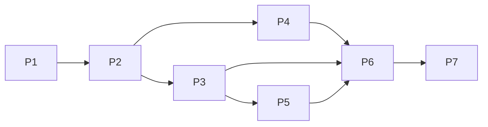

# 客服助手严格化重构总体计划

状态：阶段执行计划；2026-10-03 制定，2026-10-04 按 `2bc7cd4` 更新进度。当前差距以 [agent-conformance.md](./agent-conformance.md) 为准。
范围：`apps/api/app/services/agent/`、`apps/api/app/services/chat/`、`apps/api/app/workers/`、对应 API、迁移与测试。
总目标：把「一条完整 Agent 路径（仅订单查询）+ 一条传统消息管线（其余全部业务）」收敛为「**一个统一运行时处理全部业务目标，旧管线只保留直接回答与降级兜底**」。

进度：intake、policies、domains、事实/事件/经验存储、对象锁和预算已有代码；默认订单接管，工单/人工转交可选接管。通知/退款默认接入、自动续办、多目标依赖、经验消费、自动补偿和影子模式仍待完成。以下 §2–3 的“现状/before”保留计划制定时的基线，§4 表示当前阶段进展；设计动作不等于已完成承诺。

非目标（本计划明确不做）：
- 不改 RAG 检索质量、插件/配置框架、认证与多租户模型；
- 不引入新基础设施（不引入 Redis/消息队列，调度继续用数据库租约）；
- 前端仅在有任务时间线需求时增量补充，不重构现有聊天交互。

## 1. 重构原则

1. **绞杀者模式**：新运行时按业务域逐个接管；接管的域冻结旧实现（只做安全修复），不长期双写。
2. **契约先行、测试先行**：先落操作契约、失败语义与测试，再迁移流量。
3. **单一权威路径**：同一业务同一时刻只有一个执行路径；功能开关只用于降级与灰度，不用于长期并存。
4. **保守判定**：受理层拿不准就澄清（clarify），不猜；宁可少建任务，不误建任务。
5. **指标与文档同步**：新代码满足 code-metrics；每阶段更新 runtime / conformance / lifecycle / STATUS，不夸大（模拟证据不计入验收）。
6. **兼容约束**：SQLite / PostgreSQL 双支持；离线可测（无 LLM、无外部服务即可跑全部测试）。

## 2. 目标结构（计划基线 → 目标设计）

2026-10-03 计划制定时的基线（当前导航见 [STRUCTURE](../prd/STRUCTURE.md)）：

```
app/services/agent/
  pipeline/        # 旧管线：runner、handlers/*、slot_gate（六路由）
  loop/            # 旧固定工具循环（plan_hint 被忽略）
  intent/ router/ slots/ harness/   # 共享判定组件（保留）
  service/         # 持久任务运行时
    order.py       # 订单域：契约 + 策略
    chat_order.py  # 订单域：HTTP 连接器（与 order.py 散落两处）
  memory/          # 仅偏好 3 键
app/services/chat/service_tasks.py  # 受理逻辑藏在 chat 层，仅订单
app/workers/service_tasks.py        # 硬编码订单策略
```

目标：

```
app/services/agent/
  intake/                # 新增：目标受理（入口层）
    judge.py             # 消息 → 目标候选 / 直接回答 / 澄清 / 续办
    goals.py             # intent→goal 映射、去重键规则、目标目录
    open_task.py         # 同事务建任务 + 派发（从 chat/service_tasks.py 泛化）
  service/               # 唯一执行引擎（保留，增补）
    contracts.py         # + Decision.expected_result/stop_conditions、Task 预算字段
    policies.py          # 新增：goal → AgentPolicy 解析（替代 worker 硬编码）
    locks.py             # 新增：业务对象跨任务锁
    executor.py          # + 补偿执行与对账钩子
    runtime.py registry.py recovery.py store.py dispatch.py delivery.py
    control.py driver.py lifecycle.py settings.py inserts.py
  domains/               # 新增：按业务域组织「操作 + 策略 + 连接器 + 幂等键」
    order.py             # 合并 service/order.py + service/chat_order.py
    ticket.py handoff.py notify.py   # P3
    refund.py                        # P6
  memory/                # 扩展
    contracts.py store.py context.py
    facts.py events.py experience.py # 新增（P5）
  pipeline/              # 收敛为直答路径
    runner.py handlers/{rag,clarify,refuse}.py    # 保留
    handlers/{tool,ticket,handoff}.py loop/       # 冻结为降级兜底（P7 评估删除）
```

结构调整理由：受理是入口概念，不属于 chat 层；业务域代码集中一处，避免 order 式散落；策略解析让 worker 与具体目标解耦；记忆独立扩展，运行时只通过读管线接触记忆。

## 3. 重构动作清单

### M1 受理层抽取与泛化（P1）

- 现状：`apps/api/app/services/chat/service_tasks.py` 内联判定订单意图；intent→goal 映射不存在。
- 目标：`intake/judge.py` 输出 `IntakeDecision(verdict, goal, object_key, confidence, reason)`，verdict ∈ {goal, answer, clarify, resume}。
  - intent→goal 映射（`intake/goals.py`）：order_query→order_status；fault_report / complaint→ticket_resolution；handoff→human_handoff；faq / product→直接回答；out_of_scope→拒答。
  - 续办：会话存在 waiting_customer 的活动任务时，消息优先作为该任务的回答（resume），不新建任务。
  - 去重键：`uuid5(会话 + goal + 业务对象)`，从现有订单规则泛化。
  - 建任务与消息持久化同事务（沿用 `insert_once` 模式）。
- 改动：`chat/session/turn.py` 调用点改为 intake；`chat/service_tasks.py` 迁入 `intake/open_task.py` 后删除。
- 测试：intake 单测（五类 intent × 有无业务对象 × 有无在办任务）；已有受理/任务回归保持全绿；重发不重复建任务。
- 风险：误建任务。对策：只有「业务动作意图 + 明确业务对象或可收集槽位」才建任务；其余直答或澄清。

### M2 策略解析去硬编码（P2）

- 现状：`workers/service_tasks.py` 硬编码 `chat_order_agent` 与 `completion_condition != ORDER_GOAL` 检查；`driver.py` 同样只认订单。
- 目标：`service/policies.py` 提供 `goal → AgentPolicy` 注册表；worker 按 `task.completion_condition` 解析；未注册目标 → `owner_review:unknown_goal`。
- 改动：`workers/service_tasks.py`、`service/driver.py`；订单策略装配移入 `domains/order.py`。
- 测试：行为回归（现有测试全绿）+ 用测试策略注册第二个 goal 的冒烟测试。
- 风险：低。本步不改行为，只换装配方式。

### M3 域模块化（P2）

- 现状：订单域散落 `service/order.py`（契约 + 策略）与 `service/chat_order.py`（连接器）。
- 目标：`domains/order.py` 单文件承载操作契约（order.get_status）、连接器、observe / propose / verify、幂等键推导，作为后续域的模板。
- 测试：现有 order / service 测试迁移导入路径，行为不变。

### M4 操作目录扩展：ticket / handoff / notify（P3）

- 目标操作：
  - `ticket.create`（write）：迁移 `TicketSideEffect` 落库逻辑；幂等键 = 会话 + 类型 + 标题规范化哈希；工单回执即完成条件。
  - `handoff.enqueue`（write）：迁移 `HandoffSideEffect`；入队后等待受理为 waiting_external + 事件唤醒或轮询。
  - `notify.send`（notify）：会话外通知（邮件/渠道），通知失败不重复业务效果。
- 开关：新增 `SERVICE_TASKS_GOALS`（接管清单，默认 `order`）逐域加白；白名单外目标仍走旧管线。
- 测试：每操作契约校验（schema / precondition / 权限）；幂等重试不双执行；新旧路径行为等价测试。
- 风险：迁移期行为漂移。对策：影子模式先跑观察与决策（§5），只读操作先行放量。

### M5 判断与环境增强（P4）

- `Decision` 增加 `expected_result`、`stop_conditions`；`Task` 增加 `max_cost`、`deadline`、`no_progress_limit`。
- 环境事实扩展：工具健康、队列时长、通道能力、业务库存（全部带来源与新鲜度）。
- 多候选：notify 域先行（chat vs email，按 contact_channel 偏好与通道能力），拒绝理由写入决策记录；效用仅在估计有来源时启用，否则用确定性优先级（风险 → 成本 → 延迟 → 稳定）。
- 重新规划触发：事实过期、验证失败、预算过半、连续无进展。
- 测试：环境场景测试（健康 / 库存 / 队列变化改变选择）；决策记录断言。

### M6 记忆扩展（P5）

- `memory/facts.py`：客户事实（订单号、地址、联系时间），写入必须过验证门（显式确认或系统回执）。
- `memory/events.py`：任务时间线（从 transitions / ledger / delivery 物化，不重复存原始数据）。
- `memory/experience.py`：成功决策路径提示，仅作候选来源，执行前重验环境前提。
- 统一记录与生命周期（memory_id / scope / source / verification / validity / version / supersession / retention）；删除覆盖派生数据。
- 读管线接入 runtime（以 `with_memory` 替代仅 `with_preferences`）；记忆影响选择时写入决策理由。
- 迁移：新表 `agent_memories`（Alembic，SQLite / Postgres 兼容）。
- 测试：删除后不可检索；过期不注入；注入不越权；事实来源标记。

### M7 写操作闭环（P6）

- `domains/refund.py`：`refund.submit` / `refund.get_status`（只提交申请；到账以查询或客户确认验证）。
- `service/locks.py`：业务对象锁（同一订单并发写串行），实现与派发租约同构（条件 UPDATE）。
- 补偿执行：`Operation.compensation` 从声明变为可执行路径；不可逆操作显式声明。
- 预算：max_cost / deadline / no_progress_limit 强制进 owner_review。
- 测试：unknown 写不双执行；锁冲突串行；预算耗尽转人工；补偿路径演练。

### M8 旧管线收敛（P7）

- 每域接管后：对应 legacy handler 冻结（仅安全修复），文档标记「降级兜底」。
- 全业务接管 + 降级演练（关闭 ServiceSettings 后旧管线可用）通过后：评估删除 tool / ticket / handoff 处理器与 loop 引擎。
- 文档：runtime / conformance / lifecycle / STATUS 同步现状，去掉过时边界。

## 4. 阶段与 PR 切片（2026-10-04 进度）

| 阶段 | 已实现 | 剩余放行项 |
|------|--------|------------|
| P1 | intake 抽取、intent→goal、turn 接入与去重 | 聊天 open_task 查询/resume、多目标 |
| P2 | policies 注册表、domains/order 合并 | 兼容入口仍保留；新域逐项验收 |
| P3 | ticket/handoff 可选接管；notify 操作与 GOALS 开关 | notify builder/真实渠道、人工接单唤醒 |
| P4 | Decision 扩展、sourced_facts、候选排序与 notify 多候选 | 真实环境源、依赖计划和完整重规划 |
| P5 | facts/events/experience、偏好/事实读管线、删除关联经验 | 自动采集/经验消费、客户 API 与完整保留闭环 |
| P6 | refund 适配、对象锁、费用/时限/无进展预算 | 真实退款、未知结果对账、自动补偿、费用来源 |
| P7 | 开关分流与本文档同步 | 全业务迁移、影子模式、降级演练与旧代码清理 |

依赖关系：



## 5. 流量迁移与开关

- `SERVICE_TASKS_ENABLED`：默认 true；关闭并重启 API 后，新聊天走旧管线，API 后台任务 worker 也停止。
- `SERVICE_TASKS_GOALS`：接管清单，默认 `order_status`；支持 `order/ticket/handoff` 别名。只有订单、工单、人工转交有默认 builder。
- 影子模式：仍为待实现设计；不能把现有开关当成只读模拟执行。
- 回滚：从 GOALS 移除该域仅使新受理回退；已排队任务仍由注册策略推进，需按生命周期取消或接管。总开关停止调度不等于外部业务撤销。

## 6. 数据库与迁移

- 新表：`agent_memories`（统一记忆记录）、`service_object_locks`（对象锁）。
- Task 预算字段进入检查点 JSON，无需表结构迁移。
- 沿用 Alembic（`apps/api/alembic/versions/`），SQLite / PostgreSQL 双兼容；锁与租约同构（条件 UPDATE），不做悲观锁假设。

## 7. 测试与质量门

- 每阶段必须全绿：`pytest`（全量）、`ruff check apps/api`、`python3 scripts/ops/check_code_metrics.py`。
- 集成测试沿用 `tests/integration/test_chat_service_tasks.py` 模式（聊天 → 任务 → worker → 回写）。
- 混沌用例：重启恢复、租约过期、重复投递、unknown 写、并发人工接管。
- 环境场景：事实过期 / 健康降级 / 库存变化必须改变选择。
- 文档：每阶段更新对应文档与 STATUS；未验收能力不得写入「已实现」。

## 8. 风险与对策

| 风险 | 对策 |
|------|------|
| 误建任务（FAQ 被判为目标） | 保守判定 + 澄清优先 + GOALS 灰度 |
| 迁移期行为漂移 | 新旧等价测试 + 影子模式 + 逐域回滚开关 |
| 双实现长期并存 | 接管即冻结；P7 强制收敛并评估删除 |
| 伪效用（无来源估计） | 禁止编造概率；无估计用确定性优先级 |
| 记忆越权 / 注入 | 记忆只作提示；权限来自认证；写入验证门 |
| 指标超标 | 新代码小模块（域单文件 ≤300 行）；迁移时收敛 |
| 锁与并发缺陷 | 与租约同构的条件更新；SQLite / Postgres 双测 |

## 9. 工作量估算（粗）

| 阶段 | 规模 | 主要成本 |
|------|------|----------|
| P1 | S | 受理判定 + 迁移 + 单测 |
| P2 | S | 装配改造 + 域合并 |
| P3 | M | 三个域 + 开关 + 等价测试 |
| P4 | M | 环境字段 + 多候选 + 场景测试 |
| P5 | L | 三层记忆 + 迁移 + 生命周期 |
| P6 | L | 退款域 + 锁 + 补偿 + 预算 |
| P7 | S | 冻结与文档收敛 |

## 10. 完成定义

- [agent-conformance.md](./agent-conformance.md) §1 七项能力在每个已接管域都有可检验证据；
- conformance §7 验收场景全部通过并纳入 CI；
- 旧管线仅承担直接回答与降级，边界在文档中明确；
- 全部质量门（测试 / lint / 指标）全绿，文档无过时边界。
