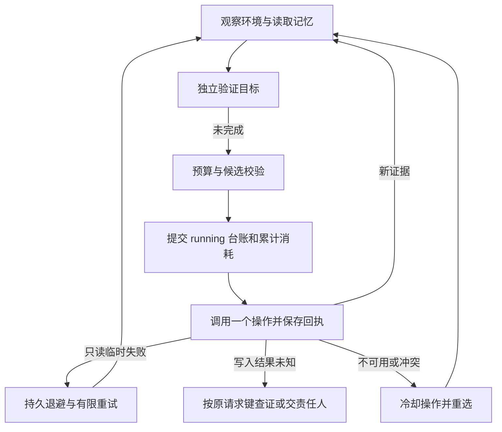

# 客服 Agent 运行基础与故障恢复

更新：2026-10-04，对照 `2bc7cd4`。本模块实现 [客服 Agent 方案](../prd/customer-service-agent.md) 的持久操作基础，并已通过聊天受理与 worker 接入部分目标；完整业务范围仍待验收。

## 1. 交付与启用边界

| 能力 | 代码与当前边界 |
|---|---|
| 目标受理 | `intake/chat.py`、`judge.py`、`open_task.py`；同事务创建任务、派发和消息 |
| 持久任务 | `service/contracts.py`、`store.py`；范围隔离、版本 CAS、检查点与操作台账 |
| 操作执行 | `registry.py`、`executor.py`；权限、输入与前置条件检查，先提交意图再调用 |
| 判断与恢复 | `runtime.py`、`selection.py`、`recovery.py`；候选过滤、比较、预算、退避和待查证状态 |
| 策略装配 | `policies.py`；默认注册订单、工单与人工转交三个目标 |
| 后台派发 | `workers/service_tasks.py`、`service/dispatch.py`；数据库租约与重启恢复 |
| 客户记忆 | `memory/`；偏好与事实每轮读取，事件和经验的接入范围见 [记忆文档](./customer-preference-memory.md) |
| 任务控制 | 客户查看、按版本取消、已领取转交的验证接管，见 [生命周期](./customer-service-lifecycle.md) |

以上相对路径除 worker 外均位于 `apps/api/app/services/agent/`。

| 目标 | 操作 / 完成语义 | 默认接入 |
|---|---|---|
| `order_status` | `order.get_status`；具体订单状态与客户归属均匹配 | 默认聊天目标 + worker |
| `ticket_resolution` | `ticket.create`；当前仅验证工单已登记，不能证明问题解决 | 目标白名单启用后由 worker 执行 |
| `human_handoff` | `handoff.enqueue`；入队不等于接单，策略还需观察 `claimed` | 目标白名单启用；接单后自动唤醒未接入 |
| `notification` | `notify.send.chat` / `notify.send.email`；需要消息回执 ID | 独立适配器，宿主提供 sender；不在默认 worker |
| `refund_request` | `refund.submit` / `refund.get_status`；申请受理不等于到账 | 独立适配器，宿主提供提交/查询；无真实退款连接器或默认 worker |

聊天目标白名单 `SERVICE_TASKS_GOALS` 默认仅 `order_status`。通知和退款虽然在目标目录中，但没有聊天意图映射和默认 builder；仅配置名称不会启用这些业务。完整环境变量和订单 webhook 响应格式见 [API README](../../apps/api/README.md#service-tasks-and-order-connector)。

## 2. 调用与授权边界

独立宿主从认证结果构造 `Scope`，创建 `TaskStore(SessionLocal)`。任务中的目标、输入、历史和记忆都是数据，不能授予权限。

```python
task = Task(
    scope=authenticated_scope,
    goal="查询我的订单状态",
    inputs={"order_id": order_id},
    completion_condition=ORDER_GOAL,
    owner="customer_support",
)
await store.create(task)
agent = order_agent(store, observe_order_environment)
result = await advance(agent, task.task_id, scope=authenticated_scope)
```

类型与入口来自 `service.contracts`、`service.store`、`domains.order` 和 `service.driver`。`observe_order_environment` 必须从可信业务服务重新取得权限、订单归属和可用操作；`facts["order_owners"]` 不能从客户文本或模型输出构造。

聊天使用同一订单域中的 scoped adapter：请求带认证客户 ID，并校验 webhook 的 `customer_id`、`order_id` 与具体状态。未配置、mock 或归属不符不会产生真实完成证据。`service/order.py`、`service/chat_order.py` 保留为兼容入口，业务实现已移至 `domains/order.py`。

策略只能提出候选；完成条件由应用的 `verify` 回调裁定。当前运行时仍是确定性策略，未接入 LLM propose、通用计划依赖图或多目标编排。

## 3. 候选比较、预算与对象锁

每轮先装载偏好和事实，过滤模拟或过期的任务证据及 `sourced_facts`，再独立验证目标。未完成时检查预算、提出候选、校验权限/参数/可用性/冷却和待查证状态，最后选择一个操作。

`selection.py` 对相同操作与参数去重。有来源的效用估计优先按效用排序，其后依次比较 priority、风险、估计成本、延迟和稳定性；无来源的 utility 不参与效用排序。`Decision` 保存候选、排除原因、选择理由、预期结果和停止条件。通知域已有 chat/email 多候选与渠道健康过滤；订单域仍为单候选，不能据此声称全业务具备最优计划能力。

| 任务预算 | 默认 / 行为 |
|---|---|
| `max_calls` | 20；调用前累计持久化，续跑不重置 |
| `no_progress_limit` | 5；没有新鲜、非模拟且内容新颖的成功证据时累计 |
| `max_cost` | 默认未设置；按候选提供的估计成本预扣 |
| `deadline` | 默认未设置；到期停止发起新操作 |
| 单操作超时 / 只读重试 | 默认 10 秒 / 2 次，操作可声明不同值 |

预算触顶转为 `waiting_external` 并记录 `owner_review:*`。费用是估计值累计，未自动关联 Cost Ledger 或真实费用；未给成本估计的候选按零累计。聊天默认任务没有设置费用上限或总截止时间。

worker 对带 `order_id` 的任务取得 `order:<id>` 对象租约，范围包含组织与客户，租期 300 秒，完成本次推进后释放。同一范围内不同任务不能同时持有该对象。直接调用 `ServiceAgent` 的宿主需自行组合 `ObjectLockStore`；对象锁不会替代外部业务系统的幂等与版本校验。

## 4. 异常与恢复



| 信号 | 行为与不变量 |
|---|---|
| 只读超时 / 连接错误 | 分类恢复，有限退避；提前唤醒被拒绝 |
| 写入超时 / 无效回执 | 记 `unknown`；不得把传输失败当成业务未发生，不盲目重发 |
| 不可用、冲突或 mock | 冷却失败操作；重选候选，无可行操作则保留责任人与复查条件 |
| 参数 / 权限问题 | 等待客户或责任人处理；不换工具绕过权限 |
| 策略回调异常 | 保存阶段错误并等待检查；不执行模型指定的任意工具 |
| 执行意图提交失败 | 存储异常传播；尚未调用外部操作 |
| 回执提交失败 / 进程退出 | 原 running 意图保留；过执行期限后转为待查证，写请求不自动重放 |
| 并发更新 / 人工状态变更 | `TaskConflict`，重新读取；旧版本不能提交新意图 |

`RecoverySignal` 保存错误分类、恢复动作和时间；客户摘要不暴露原始异常、操作参数或内部回执。`Operation.compensation` 目前只是补偿/不可逆性声明，执行器没有通用自动补偿调度。退款未知结果也仍需宿主对账流程，不能宣传为全自动退款恢复闭环。

## 5. 调度、数据与剩余验收

`advance` 每次只运行有界微步骤。worker 自动重新安排 active 任务，并按 `review_at` 唤醒 `retry:*` 等待态；其他等待条件不会仅因复查时间到了而自动执行。外部事件验签、人工接单唤醒及未知写入对账由可信宿主接入。`VerifiedWakeup` 是内部类型，不执行网络验签。

数据库已包含任务、偏好、派发、统一记忆和对象锁五类表；最新迁移为 `20261004_agent_memories_locks`。任务预算字段在检查点 JSON 内。升级步骤及 `create_all` 与 Alembic 的区别见 [数据库迁移](../../apps/api/README.md#database-upgrades)。

自动化覆盖运行恢复、派发去重、租约、对象锁、预算、记忆隔离、域操作和聊天回写，复跑命令见 [API 验证](../../apps/api/README.md#verification)。真实退款到账、自动补偿、跨会话续办、多目标计划、外部事件订阅、生产 PostgreSQL 故障切换与多实例负载仍需独立验收。
