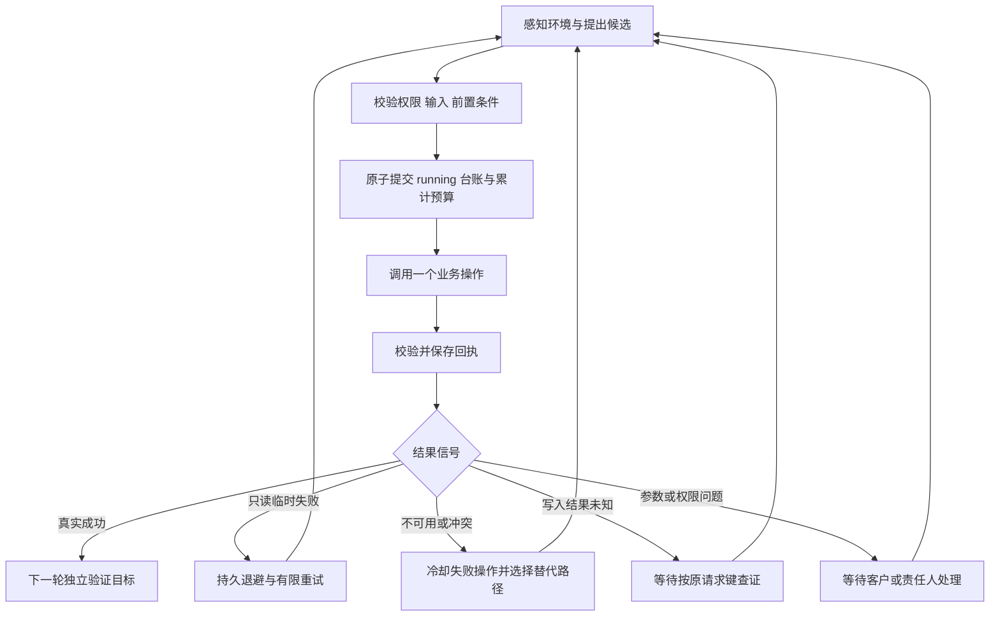

# 客服 Agent 运行基础与故障恢复

本次交付对应 [客服 Agent 提案](../prd/customer-service-agent.md) 的操作基础、目标闭环和任务记忆核心。它是可独立调用的后端模块，尚未替换聊天流水线，也未开放真实退款写入。订单场景复用现有订单连接器；其他业务需要各自的业务适配器与验收。

## 1. 交付边界

| 已实现 | 入口 |
|---|---|
| 独立操作、输入输出校验、权限与对象归属前置条件 | `app/services/agent/service/contracts.py`、`registry.py` |
| 执行前持久记录、请求键与操作版本、并发版本校验 | `executor.py`、`store.py` |
| 按新环境重新筛选候选、记录排除原因、独立验证完成条件 | `runtime.py` |
| 错误分类、有限重试、持久退避、替代路径与待查证状态 | `recovery.py` |
| 跨实例读取任务、按组织和客户隔离、证据有效期 | `store.py`、`runtime.py` |
| 有界运行、已验证事件唤醒、重复唤醒拒绝 | `driver.py`、`lifecycle.py` |
| 实际订单连接器适配、归属校验、mock 不结案 | `order.py` |
| 客户确认的偏好管理、版本化纠正和删除、每轮按范围读取 | `app/services/agent/memory/`；[接口与边界](./customer-preference-memory.md) |
| 任务查看、取消、已领取人工转交的验证接管 | `service/control.py`、`api/v1/agent/tasks.py`；[生命周期与代码导航](./customer-service-lifecycle.md) |

尚未实现：聊天入口绑定、后台定时扫描与事件订阅、自动创建/领取人工转交、退款连接器、自由文本客户事实、经验检索、按业务对象跨任务加锁、计划依赖图、费用与任务总时限预算。这些边界不能作为已上线能力宣传。

## 2. 调用方式与授权边界

宿主从认证结果构造 `Scope`，创建 `TaskStore(SessionLocal)`。任务中的 `goal`、`inputs` 与证据都是数据，不能授予权限。

订单任务示例：

```python
task = Task(
    scope=authenticated_scope,
    goal="查询我的订单状态",
    inputs={"order_id": order_id},
    completion_condition=ORDER_GOAL,
    owner="customer_support",
)
await store.create(task)
agent = order_agent(store, observe_order_environment)
result = await advance(agent, task.task_id, scope=authenticated_scope)
```

相关类型与入口分别从 `service.contracts`、`service.store`、`service.order` 和 `service.driver` 导入。`observe_order_environment(task)` 是宿主必须实现的认证边界：每次运行从可信业务服务重新取得订单归属、操作权限及连接器健康状态，然后返回 `Environment`。`facts["order_owners"]` 必须来自业务系统，不能从客户文本或模型推断构造。

可用能力包含 `order.get_status`，权限包含 `orders.read`，且订单归属匹配时才会调用现有 `search_order`。真实订单证据只能满足订单状态查询，不能证明退款、物流异常已解决等其他目标。

`AgentPolicy.propose` 可使用规则或结构化模型提出候选。当前排序使用明确的 `priority`（数值越小越优先），没有编造成功率或全局最优保证。权限、参数、归属与故障冷却先过滤候选，剩余候选再比较。`verify` 必须是宿主提供的确定性业务判定，不能直接信任模型的“已解决”判断。

运行时每轮装载 `Environment.preferences`，供策略读取有效的客户确认偏好。本轮明确选择优先，偏好读取故障不会中断普通任务。偏好不进入任务检查点，也不修改事实和权限。

## 3. 异常消化与恢复链



| 信号 | 行为 | 不变量 |
|---|---|---|
| 超时、连接错误 | 只读操作进入退避；写操作进入 `unknown` | 不将传输失败解释成业务未发生 |
| 只读临时失败 | 默认最多重试两次，退避时间持久保存 | 重启不清零任务调用预算；提前唤醒被拒绝 |
| 工具不可用、冲突、mock | 冷却该操作，下一轮尝试其他可行候选 | 没有替代候选时保留责任人与复查时间 |
| 明确的参数错误 | 只读任务等待客户补充 | 写操作不自动重发 |
| 权限不足、不可恢复错误 | 等待责任人检查 | 不靠重试或换工具绕过权限 |
| 模型输出格式错误、观察或验证回调异常 | 保存对应阶段的错误信号并等待检查 | 不执行任意工具、不输出未验证完成状态 |
| 台账提交失败 | 中断当前调度并向宿主传播存储异常 | 意图提交失败时没有外部写操作 |
| 写入后回执保存失败、进程退出 | 保留原 `running` 意图，过执行期限后转为待查证 | 原写请求不会因恢复而再次发出 |
| 并发更新或人工状态变更 | `TaskConflict` 向宿主传播，重新读取任务 | 旧快照不能提交新执行意图 |

故障信息存储在 `Task.recovery_signals`，包括操作、请求键、错误分类、恢复动作与时间。原始异常字符串不直接写入客户可见状态，避免暴露连接器凭据或内部响应。操作台账保留结构化回执与证据。

## 4. 宿主调度职责

`advance` 每次最多执行有限个微步骤；返回 `active` 表示应重新排队，返回等待态表示需要相应事件。正在执行且未超过期限的操作直接返回，不让另一个 worker 抢占或重放。超出期限的意图变成待查证数据，而不是自动重试写操作。

宿主持久安排 `review_at`，校验事件来源、任务归属及对应 `wake_condition` 后，构造 `VerifiedWakeup` 并调用 `resume`。这个类型只是内部接口名称，本身不验证外部签名。网络事件验签、任务查找和授权必须在进入接口前完成。重复事件不会再次把 active 或 resolved 任务唤醒。

遇到 `TaskConflict`，宿主重新载入后再调度；遇到数据库异常，宿主使用自己的有界重试队列。运行时不会吞掉存储异常并继续交易。`waiting_external` 的责任人目前是任务数据，不代表人工队列已经接单；宿主必须对接队列并核实受理后才能标记 `handed_off`。

当前已提供验证接管接口：要求已有转交记录由当前人员领取，并核对任务客户和会话，再原子设置 `handed_off`。队列创建和领取仍使用现有人工协作流程，不由运行时自动发起。

外部写入适配器必须将原请求键传给业务系统，并提供按同一键查证的只读操作。不同任务操作同一业务对象时仍依赖业务系统幂等、版本检查或宿主对象锁。本模块不提供跨业务系统的“恰好一次”保证。操作处理器必须遵守协程取消及连接器网络超时；Python 无法强行终止主动忽略取消的协程。

## 5. 数据库与验证

新增 `service_tasks` 表只保存任务检查点，组织和客户范围位于独立索引列。每次提交以旧版本作条件更新，受影响行数不为一则拒绝继续。操作意图和累计预算在外部调用之前由独立事务提交。

生产迁移：在 `apps/api` 使用项目环境运行 `python -m alembic upgrade head`。这是仓库首个提交的版本迁移，只新增本表，不重建已有业务表。开发环境现有的 `init_db` 也会创建本表；已通过 `create_all` 创建表的开发数据库不要直接重复执行同一建表迁移。

验证入口：

```bash
cd apps/api
.venv/bin/python -m pytest tests/unit/test_service_agent.py tests/unit/test_service_recovery.py tests/unit/test_service_order.py tests/unit/test_service_migration.py -q
```

测试覆盖组织与客户隔离、断点恢复、权限和归属、重复请求、并发执行、写入超时、回执保存失败、台账不可写、退避重试耗尽、替代路径、错误模型输出、证据过期、mock、实际订单适配与迁移往返。真实退款到账、外部队列受理及生产 PostgreSQL 故障切换仍需要各自的集成验收。
