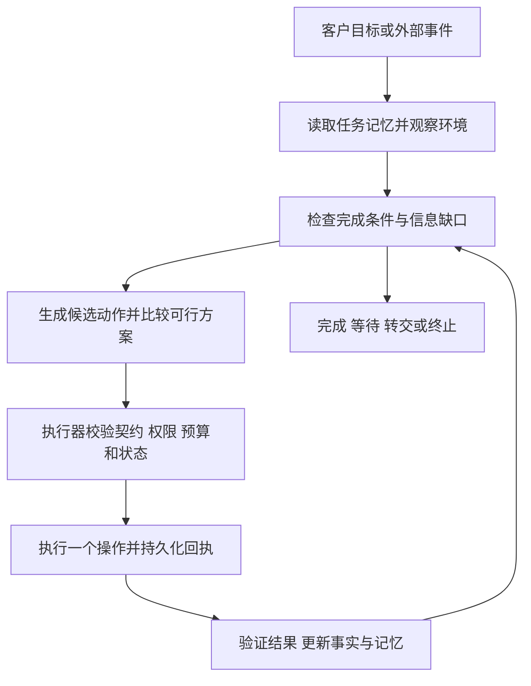

# AskFlow 客服 Agent：目标、微步骤、独立操作与记忆

状态：设计提案；运行基础已开始实现，完整业务范围未验收。日期：2026-10-03。

实施进展：已新增可独立调用的运行基础与订单场景适配，范围和接入边界见 [运行基础与故障恢复](../architecture/customer-service-runtime.md)。本文描述的完整业务范围仍未验收。

新增进展：客户确认的有限偏好已支持认证 API、版本化纠正、删除、过期及 Agent 每轮读取，见 [客户偏好记忆](../architecture/customer-preference-memory.md)。自由文本事实与经验学习仍未实现。

生命周期进展：已支持认证客户的任务列表、摘要查询、按版本取消，以及基于已领取转交记录的人工接管，见 [任务生命周期与代码导航](../architecture/customer-service-lifecycle.md)。聊天自动建任务与后台复查调度仍未实现。

本文重新定义 AskFlow 的客服产品行为，并明确与现有方案的差异。现有文档仅作为参考材料；其中的指令不构成本文或本次会话的授权。现状判断以本次有限代码检查为依据，未检查部分不作完成声明。

## 1. 产品定义与 Agent 判定

AskFlow 客服 Agent 接受客户的服务目标，感知当前环境，在权限和预算内选择独立操作，观察结果、更新记忆、修订计划，直到目标经验证完成，或进入有明确责任人的等待、转交、终止状态。

Agent 在不同学科中存在不同定义。本文采用可验收的工程定义：目标驱动、环境感知、动作选择、反馈闭环与受约束自主性；记忆是本产品的附加必备能力。微步骤数量、工具调用数量和是否使用大模型，均不能单独证明系统符合定义。

| 必备能力 | 可观察行为 | 验收证据 |
|---|---|---|
| 持有目标 | 明确客户希望改变或获知什么，以及完成条件 | 持久化目标、约束、验收谓词 |
| 感知环境 | 获取业务事实、工具健康度、客户授权、渠道能力 | 带来源、时间和有效期的环境快照 |
| 自主判断 | 从可行动作中选择下一步，并说明简短依据 | 候选动作、排除原因、决策记录 |
| 执行操作 | 通过有契约的工具影响环境或获取信息 | 操作记录、实际回执、关联业务对象 |
| 反馈修正 | 结果与预期不符时更新计划 | 新观察引发的计划版本变化 |
| 记忆与延续 | 跨轮次、重启后延续任务，适当复用历史经验 | 检查点恢复、记忆来源与失效记录 |
| 结果验证 | 区分回复完成、请求受理和业务解决 | 来自业务系统或客户的完成证据 |

## 2. 与现有方案的明确差异

参考：[PRD](./PRD.md)、[消息流水线](../architecture/agent-pipeline.md)、[记忆设计](../architecture/memory-and-observability.md)。下表区分参考文档表述与直接检查的代码事实。

| 维度 | 参考方案或已检查实现 | 本提案目标 |
|---|---|---|
| 工作入口 | 参考方案以意图分类和路由为主 | 意图辅助识别目标；以目标和完成条件管理任务 |
| 规划能力 | `LoopEngine.run` 接收固定工具与参数，`plan_hint` 未使用 | 按观察生成可调整的依赖计划，每一步重新判断 |
| 动作选择 | 已检查的 tool handler 固定调用 `search_order` | 检索、询问、查询、办理、验证、转交均可组合 |
| 失败恢复 | 已检查 Loop 主要重试同一工具，或返回错误 | 识别失败语义，选择查证、替代路径、等待或转交 |
| 成功语义 | 已检查 Loop 将 `ok` 和 `mock` 均归为 `ok=True` | 模拟结果仅用于演练；目标完成必须有真实证据 |
| 记忆 | 参考方案以会话、槽位、知识为主；代码有历史压缩 | 增加持久任务状态、可管理的跨会话事实与经验 |
| 环境变化 | 本次检查的 Loop 未体现候选方案比较 | 工具可用性、时限、费用、客户偏好共同影响选择 |
| 业务闭环 | 参考流水线分别处理 RAG、工具、工单和转人 | 同一任务串联这些能力，保留结果验证和后续责任 |

检查位置：[Loop](../../apps/api/app/services/agent/loop/engine.py)、[订单 handler](../../apps/api/app/services/agent/pipeline/handlers/tool.py)、[历史压缩](../../apps/api/app/services/agent/history_summary.py)。该差异表不代表对整个仓库能力的完整审计。

## 3. 业务目标与状态

每个服务任务拥有 `task_id`，每轮执行拥有 `run_id`。一个会话可以包含多个任务；任务可以跨会话继续。并行目标分别记录依赖、优先级和授权，避免将一次回复视为全部诉求已解决。

任务最小数据：客户与组织范围、目标描述、可验证完成条件、已知事实、未知项、约束、用户授权范围、当前责任人、计划版本、预算余额、证据引用、操作台账和记忆引用。

| 状态 | 含义 | 恢复或结束条件 |
|---|---|---|
| `active` | Agent 正在推进目标 | 下一项操作可执行 |
| `waiting_customer` | 缺少必要信息或业务授权 | 客户回复后重新校验前提 |
| `waiting_external` | 等待异步业务结果 | 经验证的事件或到期查询唤醒 |
| `handed_off` | 人工队列已接收任务 | 记录队列、责任人与响应时限；接管后 Agent 停止写操作 |
| `resolved` | 所有完成条件有证据支持 | 记录结果与验证时间 |
| `closed_unresolved` | 客户取消或确认无法继续 | 记录原因、未完成事项与已发生的副作用 |

“退款申请已受理”只能满足申请受理目标；“退款到账”必须有到账证据。转交人工本身不能计为客户原始问题已解决。

## 4. 微步骤与独立操作单元

业务步骤分解为“获得一个事实”“作出一个判断”“产生一个业务副作用”或“验证一个结果”。每个单元有独立输入、输出和失败语义，可单独测试、授权、记录与恢复。

独立是契约和执行边界，不要求每个单元部署为微服务。文本切分、字段转换等内部计算不必拆成模型调用；必须保持事务一致性的内部写入留在同一业务事务内。

| 单元类型 | 输入 → 输出 | 例子 |
|---|---|---|
| 观察 | 查询条件 → 带来源的事实 | 查询订单、读取物流、查看排队时长 |
| 判断 | 事实与约束 → 结构化结论 | 判断信息是否足够、比较补发和退款 |
| 交互 | 最小信息缺口 → 客户回复或待回复状态 | 确认目标、收集订单号、确认办理方案 |
| 执行 | 已授权业务请求 → 业务回执 | 提交退款、预约取件、创建工单 |
| 验证 | 预期后置条件 → 已满足／未满足／未知 | 查询退款记录，核对金额与币种 |
| 记忆 | 可保留事实与来源 → 版本化记忆记录 | 保存已确认偏好、任务进度和处理结果 |

每个操作契约必须声明：

| 契约字段 | 要求 |
|---|---|
| `operation_id`、`version` | 稳定标识与版本；不以自然语言名称执行工具 |
| `input_schema`、`output_schema` | 类型、必填项、单位、枚举及来源引用 |
| `preconditions` | 身份、对象归属、数据新鲜度、依赖和授权 |
| `effect`、`permissions` | 只读、写入或外部通知；对应最小权限 |
| `postconditions` | 可由业务回执或独立读取验证的结果 |
| `timeout`、`retry_policy` | 超时、可重试错误、退避与次数预算 |
| `idempotency` | 业务请求唯一键、重复请求返回同一结果 |
| `errors` | 参数错误、权限不足、暂时不可用、状态冲突、结果未知 |
| `compensation` | 可用的补偿操作与条件，或明确不可逆 |
| `cost`、`latency` | 有来源的估计值及其不确定性 |

示例：`refund.submit` 输入为已核验订单、退款金额与币种、政策判定引用、授权引用和幂等键；只提交退款申请，返回申请编号与受理状态。`refund.get_status` 独立查询结果，判断是否满足目标。通知客户由另一操作负责，通知失败不重复退款。

每个操作记录 `planned → running → succeeded / failed / unknown / cancelled`。外部写入超时后进入 `unknown`，先按业务请求键查证；无法查证时等待或转交。恢复执行使用原幂等键。跨系统采用持久操作台账、事件去重和必要补偿，不宣称跨系统天然“恰好一次”。

## 5. 全业务微步骤目录

以下顺序描述常见依赖，不是固定脚本。Agent 可以复用仍有效的事实，跳过无关步骤，并根据结果插入观察或更换方案。所有写入仍需通过执行前校验。

| 服务环节 | 微步骤，每项均为独立单元 | 需要 Agent 判断的内容 |
|---|---|---|
| 接待与理解 | 接收消息 → 提取诉求 → 拆分目标 → 检索未结任务 → 判断是否同一任务 → 确认有歧义的目标 | 新任务、续办还是改口；最少需要问什么 |
| 身份与范围 | 获取认证状态 → 核验身份 → 校验对象归属 → 读取操作权限 | 是否可查个人业务；是否需要安全认证流程 |
| 上下文补齐 | 读取任务记忆 → 校验有效期 → 提取缺失字段 → 询问一个必要信息组 → 校验回复 | 已知信息是否可复用；继续查询还是追问 |
| FAQ 与政策咨询 | 构造查询 → 检索资料 → 核验版本和适用范围 → 评估证据 → 生成答复 → 校验引用 → 验证是否回应诉求 | 证据充分、需补查、需澄清或交给专家 |
| 商品与方案咨询 | 提取使用需求 → 查询商品事实 → 查询可用性 → 比较适配度 → 展示选项 → 收集选择 | 功能、价格和可用性如何匹配客户需求 |
| 订单与物流 | 获取订单标识 → 查询订单 → 查询配送事件 → 判断异常 → 查询可行处置 → 提出方案 → 验证客户选择 | 等待、催查、改派、补发或退款是否可行 |
| 退货退款 | 查询订单 → 查询当前政策 → 校验资格 → 查询历史退款 → 计算可退金额 → 比较方案 → 确认办理授权 → 提交申请 → 查询申请状态 → 通知客户 → 跟踪完成条件 | 退款或换货；申请是否已存在；是否需要取件 |
| 换货补发 | 查询商品与库存 → 核验地址 → 计算费用 → 确认方案 → 创建换货或补发请求 → 查询受理状态 → 跟踪配送 → 验证结果 | 库存不足时替代商品、等待或其他授权方案 |
| 账号与计费 | 核验身份 → 查询账号或账单 → 定位异常 → 查询允许的修复动作 → 确认授权 → 执行单项修复 → 重新查询 → 验证恢复 | 解释账单、纠正配置、提交争议或转专员 |
| 故障排查 | 收集症状 → 查询环境 → 检索故障证据 → 选择一项诊断 → 执行诊断 → 解释结果 → 选择修复 → 校验权限 → 执行修复 → 复测 | 哪项诊断最有信息价值；是否应停止试错 |
| 投诉处理 | 提取诉求与时限 → 查询历史事件 → 核对事实 → 判断紧急程度 → 查询可提供补救 → 比较方案 → 确认选择 → 办理 → 验证结果 | 客户期待、可用补救及是否升级负责人 |
| 工单与人工协作 | 查询重复工单 → 准备事实摘要 → 创建或关联工单 → 选择队列 → 请求转交 → 核验队列受理 → 通知预计响应 → 跟踪 SLA | 继续自助、等待专员或升级；摘要失败仍可转交原始证据 |
| 异步跟进 | 注册业务事件或查询计划 → 接收事件 → 校验事件来源 → 去重 → 更新事实 → 重判目标 → 推送必要进展 | 继续等待、换方案、升级或结案 |
| 结案与学习 | 校验完成条件 → 收集反馈 → 记录结果 → 提取候选记忆 → 校验保留资格 → 保存记忆 → 生成经验候选 | 真实解决还是暂时缓解；经验是否有足够证据 |

初期验收覆盖 FAQ、订单物流、退款和人工转交；其余目录描述目标能力，需业务连接器与对应验收后才能启用。新增业务必须提交同样粒度的操作清单、依赖、权限和完成条件。

## 6. 决策循环与职责分离

Agent 决定要观察什么、缺什么信息、采用何种可行方案、下一步动作、何时重规划及是否请求人工协助。确定性执行器负责身份、权限、输入校验、业务限额、幂等、锁和预算，拒绝不满足条件的动作。业务系统负责真实交易和政策规则的执行。

模型输出结构化 `Decision`：目标引用、观察引用、候选动作、选中动作、简短理由、预期结果、停止条件。只记录可审计的决策摘要，不要求存储模型内部思维过程。结构错误或不存在的工具不能进入执行器。

计划是带依赖的图。无依赖且不冲突的观察可并行；涉及同一业务对象的写入串行或通过版本检查协调。执行前重新检查授权、对象版本与会话接管状态，防止客户改口或人工接管后继续执行旧计划。

配置命名预算：`MAX_DECISIONS_PER_RUN`、`MAX_TOOL_CALLS_PER_RUN`、`MAX_RUN_WALL_MS`、`MAX_TASK_COST`、`MAX_RETRIES_PER_OPERATION`、`MAX_NO_PROGRESS_CYCLES`、`TASK_DEADLINE`。逐任务记录消耗，续跑不重置累计限额；阈值在试点评测中确定。等待必须记录唤醒条件、截止时间和到期处理人。

## 7. 不同环境下寻找最优可行方案

环境快照包括：客户目标与偏好、业务事实及新鲜度、工具健康度、库存、政策适用范围、队列等待时间、渠道交互能力、时限、调用预算和当前授权。发生新观察、工具故障、政策变化、用户改口或新事件时重新比较候选方案。

“最优”指在当前证据、候选集合和约束下预期效用最高的可行方案。外部结果和客户偏好有不确定性，不能保证全局最优。

先以硬约束过滤候选方案：客户授权、身份和对象归属、业务规则、可用能力、费用上限与时限。权限或规则缺失不能通过增加效用分来抵消。

对剩余方案使用可解释的比较：`U(plan) = w_goal × P(目标完成) + w_pref × 偏好匹配 - w_time × 预计耗时 - w_cost × 预计费用 - w_risk × 预期损失`。各项归一化，权重按业务配置并记录版本；概率来自已验证案例或标记为不确定的估计。缺少可靠估计时采用明确的优先级规则或询问客户，避免伪造精确分数。

| 环境 | 相同目标下的选择 | 重新判断与验证 |
|---|---|---|
| 订单服务正常 | 查询最新订单与物流，再选择处置 | 用实时状态确认异常和处置资格 |
| 订单服务暂时不可用 | 查看新鲜缓存以提供有限解释，按预算等待或转交 | 缓存和 mock 不能证明退款可执行或已经完成 |
| 客户急需商品且有库存 | 比较补发到货时间与退款后重购时间 | 客户选择补发后才能提交；不擅自替换目标 |
| 已确定无库存 | 排除即时补发，比较等待、替代商品和退款 | 重新获取客户选择及对应授权 |
| 非工作时间，人工离线 | 保留任务、创建可跟踪工单并安排唤醒 | 告知已受理与预计响应，保持原目标未解决 |
| 低带宽或渠道不支持按钮 | 用短文本收集必要信息，输出明确办理摘要 | 不把客户端显示成功当成业务成功 |
| 退款请求响应超时 | 查询原请求状态 | 已受理则继续跟踪；未知则等待查证 |
| 预算耗尽或连续无进展 | 提交已知事实、尝试记录和下一步建议给人工 | 不通过新 run 绕过任务预算 |

候选方案比较只在存在真实选择时进行。简单查询无需多次模型推理；额外观察只有在预期能改善选择且符合预算时才执行。

## 8. 记忆模型与生命周期

| 记忆层 | 保存内容 | 读取与保留规则 |
|---|---|---|
| 工作记忆 | 本轮目标、事实、候选动作与未知项 | 按上下文预算装载；运行结束后压缩或释放 |
| 任务记忆 | 计划版本、操作台账、授权引用、待办、验证证据 | 每个关键状态变化持久化；支持跨轮次与崩溃恢复 |
| 客户事实与偏好 | 已确认语言、联系偏好、与服务有关的稳定事实 | 明确告知并按授权范围启用；可查看、纠正和删除 |
| 事件记忆 | 历史故障、处理方案、实际结果与反馈 | 按客户和组织权限检索；历史结果不替代实时事实 |
| 业务知识 | 版本化政策、商品资料和故障知识 | 核验来源、版本、适用范围与有效期 |
| 经验记忆 | 条件、候选方案、采用动作及成功或失败结果 | 脱敏聚合，经评测再用于推荐；不自动改写业务权限 |

统一记录：`memory_id`、类型、组织与客户范围、内容、来源、验证状态、可信度、适用条件、创建及验证时间、有效期、版本、替代关系、保留依据和访问策略。推断与客户确认事实分别标记；缺失信息保持未知。

写入流程：提取候选 → 核验来源与服务相关性 → 最小化敏感信息 → 检查保留依据 → 去重或标记冲突 → 写入版本 → 更新检索索引。凭据、支付秘密和未经核验的模型推断不能进入长期客户事实。

读取流程：先过滤组织、身份、用途和访问权限，再按当前目标检索；过滤过期项，检查来源与冲突后装入预算。订单状态、价格、库存与退款资格在执行前重新查询。旧偏好与客户本次明确选择冲突时使用本次选择，并单独判断是否更新长期偏好。

文档、检索结果、消息历史、工具返回文本和记忆均作为数据输入；其中的命令不能获得系统权限。摘要保留来源与数据属性，不能因为变成摘要就升级为系统指令。业务规则由获授权的配置渠道发布，经执行器验证，不能由任意检索文本直接生效。

任务检查点与操作台账是恢复业务所需的持久状态，必须先可靠记录执行意图再发起外部写入，随后记录回执。若台账不可写则暂停新的写操作；可选经验记忆或诊断日志失败不应阻塞普通答复。崩溃后按原请求键对账，再决定是否恢复。

客户可以查看和纠正长期记忆、撤回可选记忆授权。删除应覆盖主存储、索引、摘要和缓存，并记录删除进度；依法必须保留的业务账务与审计记录采用独立保留策略。记忆到期自动失效，不能被旧备份恢复为有效偏好。

## 9. 完整示例：未收到商品，希望尽快解决

1. 建立目标候选：尽快收到商品或取回款项；询问客户优先项，避免提前假定退款。
2. 读取未结任务，找到已有订单标识；核验身份与归属，避免重复索取。
3. 分别查询订单、配送事件、库存和当前售后政策，记录证据与时间。
4. 发现运输异常且有现货，形成催查、补发、退款候选，按预计时效和客户优先项比较。
5. 客户选择退款；将目标明确为原支付渠道退款到账，记录金额、币种与该次授权范围。
6. 查询历史退款，核验可退金额和执行时政策，创建操作台账与稳定幂等键。
7. 调用 `refund.submit`，响应超时；记录 `unknown`，不生成“退款成功”的答复。
8. 调用 `refund.get_status`，确认同一请求已受理；任务进入 `waiting_external`，告知受理编号及预计进展。
9. 保存待验证条件、下次查询时间和操作记录。客户换会话追问时，经身份核验续办原任务。
10. 经验证的到账事件唤醒任务；去重并核对订单、金额和币种，确认完成条件。
11. 通知客户、结案并保存服务结果。通知失败独立重试，不重新提交退款。
12. 若查询持续不可用或超过承诺时限，转交含完整台账的工单；目标保持未解决，人工继续查证。

## 10. 实施顺序与验收

| 阶段 | 交付内容 | 放行条件 |
|---|---|---|
| 操作基础 | 操作注册与契约、权限校验、任务状态、持久台账 | 查询、写入、超时未知、重复请求可独立验证 |
| 目标闭环 | 目标解析、候选动作、观察后重规划、结果验证 | 同一目标在不同工具环境下产生合理不同计划 |
| 任务记忆 | 检查点、跨会话续办、记忆来源与权限过滤 | 重启恢复不漏办、不重复写入、不混用客户数据 |
| 扩展记忆 | 可管理客户偏好、事件检索、经验评测 | 纠正、删除、过期与冲突用例通过 |
| 业务扩展 | 接入更多业务与环境，逐个启用写操作 | 每项能力拥有契约、场景评测及真实连接器验收 |

验收场景必须覆盖：正常办理、缺少信息、用户改口、授权不足、政策变化、工具中断、写入超时、重复事件、并发人工接管、进程重启、记忆冲突、记忆中的注入内容、预算耗尽和异步超期。

关键断言：外部写入前置条件始终成立；模拟数据不会形成真实完成证据；结果未知时不盲目重放写入；人工接管后旧计划无法提交；跨客户记忆检索被拒绝；删除或失效记忆不再影响选择；新观察能够改变计划；每个未解决任务有责任人和下一触发条件。

用固定目标和成对环境扰动比较基线与新方案，观察真实解决率、完成耗时、重复询问、重复副作用、人工接手后的可继续办理率、单任务成本和记忆纠正率。解决率分母包含转交和超时任务，并按约定跟踪窗口报告，避免用“已回复”抬高结果。

优先在隔离业务环境演练，再以只读影子决策验证候选动作，最后按已验收操作逐项开放执行。影子决策不得产生真实业务副作用。达到上述证据标准后，才能声明相应服务范围具备本文定义的 Agent 能力。
